# Documentation technique 

## Résumé 
FitJourney est une application permettant, d'une part, à un coach sportif de gérer et effectuer le suivi de tous ses clients avec des données d'entrainements récupérées à l'aide de montres connectés Polar. D'autre part, elle permet aux clients d'accéder à leurs programmes d'entrainements et de nutrition. L'application permet également aux clients de visionner le détail de chacune de leurs séances.

FitJourney est une application WEB réalisée avec le framework Flask du langage Python, elle repose principalement sur l'API Polar Accesslink qui permet l'utilisation des données des montres connectées

Ce document reprend toutes les étapes du projet qui a été réalisé dans le cadre du travail de diplôme de la formation Technicien ES en informatique de Thomas Fujise.

## Abstract
FitJourney is an application that allows personal trainers to follow up all their clients training data that is retrieved using Polar connected watches. It also allows clients to access their training and diet plan. The application allows clients to look at the details of each of their workouts.

FitJourney is a WEB application made with Flask Python framework. It relies mainly on the Polar Accesslink API which allows the use of data from connected watches.

This document contains all the steps of the project, which was carried out within the diploma project of the IT Technician formation of Thomas Fujise

## Introduction
Dans le cadre de notre deuxième et dernière année au CFPT Informatique en tant que Technicien ES, il nous est demandé de réaliser un travail de diplôme dans le but de valider les compétences acquises tout au long de cette formation. J'ai fait le choix de développer "FitJourney", une application web qui facilite la pratique du métier de coach sportif.

Cette application permet de gérer le suivi des clients allant de l'importation des programmes individuels des clients à la récolte des données d'entrainements à l'aide de montre connecté Polar. Elle permet également de gérer une salle de sport avec les cartes de membres qui permettent l'accès à la salle. Ayant passé un diplôme de coach sportif l'année passée, j'étais à l'aise avec les besoins qu'un professionnel aurait en cas d'utilisation de l'application.


## Cahier des charges
### Contexte
Développer une application web regroupant des clients et des coachs de sport. L'application permet le suivi des clients et peut récupérer des données d'entrainements directement depuis un appareil connecté Polar. 

Il existe aujourd'hui, très peu d'outil qui permet à un coach sportif de gérer sa salle de sport avec le suivi de tout ses clients. C'est pourquoi, j'ai décidé de développer une application qui permettrait de gérer une salle de sports ainsi que le suivi des clients et de l'utiliser en tant que sujet pour mon travail de diplôme. 


### But du projet
Le but du projet est de créer une plateforme web regroupant clients et coachs afin de gérer une salle de sport et le suivi des clients.
Les données d'entrainements suivantes sont récupérées depuis une smartwatch Polar:

* Pulsation cardiaque (Repos/Actif/Après effort)
* Le type d'exercice effectué
* Date et durée de l'entrainement
* Nombre de total de calories brulées 
* Nombre de calories active
(Optionnel)
* Les données relatives au sommeil 
    * Pulsation cardiaque
    * Cycles de sommeil
    * Interruption
    * Hypnogramme

Il y a également un système de badging pour savoir quand le client rentre et sors de la salle de sport à la fin de son entrainement. 

### Cas d'utilisations
2 cas d'utilisations sont possibles avec l'application.

#### Client 

Le cas d'utilisation pour client : 


Le client doit se connecter pour avoir accès à l'application, il ne peut pas se créer de compte lui même.

Si le client se connecte à l'application, il a alors accès à plusieurs fonctionnalitées :

* Visualiser/Télécharger ses programmes (Entrainement et Nutrition)
* Laisser un retour sur une session effectué
* Laisser un retour sur le coaching de manière générale
* Gérer son profil


#### Coach

Le cas d'utilisation pour coach :


Le coach à lui également 2 possibilitées en arrivant sur l'application (Enregistrement et connexion).

Une fois connecté, le coach à accès à une multitude de fonctionnalitées :

* Ajout d'un nouveau client (création du compte client)
* Ajouter une session avec un client (Prise de rendez-vous)
* Gérer son profil

Il a également accès à des fonctionnalitées pour gérer ses clients : 

* Importation des programmes (entrainement et nutrition)
* Renouveller l'abonnement souscrit par le client
* Effectuer un bilan avec un client 
* Changer la carte membre du client


### Spécifications
* Les données d'entrainements sont récupérées avec l'API Accesslink de Polar en Python sous forme d'objet, elles sont vérifiées et stockées directement dans la base de données
* Le système de badge fonctionne à l'aide de cartes RFID et un lecteur NFC (ACS ACR 122u) 
* Les graphiques liés aux stats sont effectués avec la librairie javascript Chart.js
* Les programmes d'entrainements et de nutritions doivent respecter le format proposé (Lors de l'upload une vérification est effectuée)
* Un système de notification est mis en place pour avertir les utilisateurs des différents événements

### Restrictions
- Pour l'instant, il est uniquement possible d'utiliser des appareils Polar pour les données d'entrainement.
- Le système de badge est utilisé au début et à la fin et non pendant l'entrainement.
- L'API accepte au maximum 500 requête pour 20 utilisateurs différents en 15 min et 5000 pour 100 utilisateurs en 24h
- Les montres utilisées lors des entrainements sont celles du coach (montres déjà enregistrées sur le compte client qui accède à l'API)

### Environnement
Les technologies a utiliser:

* HTML5
* CSS3 
* Javascript
* SQL 
* Python
* Flask (Micro Framework Python)
* Lecteur NFC (ACS ACR122U)
* [API AccessLink Polar](https://www.polar.com/accesslink-api/#polar-accesslink-api)
* [Chart.js](https://www.chartjs.org/)


Système d'exploitation :

* Développement sur Windows

Versionning / Documentation :

* GitHub
* MarkDown (Mkdocs)
### Contact
#### Étudiant
- **Prénom** : Thomas 
- **Nom** : Fujise 
- **Email** : thomas.fjs@eduge.ch
- **Téléphone** : +41 (0) 77 463 89 68  

#### Enseignant
- **Prénom** : Sébastien 
- **Nom** : Jossi 
- **Email** : edu-jossis@eduge.ch
- **Téléphone** : /

### Dates importantes
| Date  |  Tâches |  
|---|---|
|**Lundi, 04 avril 2022** | Début du travail de diplôme|
|**Mardi, 26 avril 2022**| Évaluation intermédiaire 01|
|**Lundi, 09 mai 2022**| Rendu du rapport intermédiaire + poster & Rendu du résumé et de l'abstract|
|**Mardi, 10 mai 2022**| Évaluation intermédiaire 02|
|**Jeudi, 12 mai 2022**| Après-midi/Soirée poster|
|**Mardi, 24 mai 2022**| Évaluation intermédiaire 03|
|**Vendredi, 10 juin 20222**| Rendu du travail avant 12:00|

### Livrable
* Documentation technique + journal de bord
* Mode d'emploi
* Poster
* Code source


## Analyse de l'existant
### Inithy
{width=200 align="right"}
Inithy est une application de coaching "tout-en-un" qui propose énormement de fonctionnalités. Elle permet le suivi des client, le planning de sessions, l'importation de programmes ou encore l'interaction entre utilisateurs de l'application. Elle possède une fonctionnalité de synchronisation avec les applications de sports comme *GoogleFit*, *Apple Santé* ou encore *Fitbit*. La synchronisation avec *Polar* et *Garmin* n'est pas disponible avec leurs application. Il y a également la possibilité d'effectuer des paiements sur l'application pour acheter un abonnement. C'est une application très complète qui répond à beaucoup de besoins que j'ai identifié précédemment. Le principal point qui me différencie de cette application, est que *FitJourney* est plus axé pour gérer une salle de sport et les clients membres(pour un coach sportif qui aurait son studio de coaching par exemple) que pour le coaching en ligne comme l'est *Inithy*. 

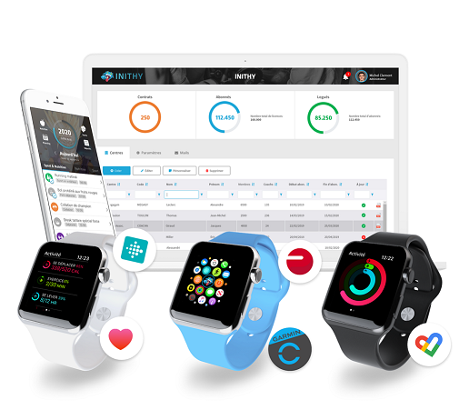

## Analyse fonctionnelle

### Fonctionnalités
#### Description générale
L'application est accessible par n'importe qui possédant un compte. Seuls les coachs ont accès à la page d'enregistrement pour se créer un nouveau compte et c'est également que les coachs qui peuvent créer un compte pour un client. Une fois connecté, l'utilisateur à accès à plusieurs fonctionnalités en fonction de son rôle (coach ou client)

#### Description détaillée
##### Application coach
* Le coach s'inscrit et s'authentifie avec un formulaire;
* Le coach peut modifier les informations propres à son compte utilisateur (nom, prénom, birthdate, email, photo de profil, adresse et mot de passe);
* Le coach peut ajouter un client en lui créant un compte et en séléctionnant le type d'abonnement que le client souhaite prendre;
* Le coach peut enregistrer une session qu'il prévoit avec un de ses clients en renseignant :
    * La date;
    * L'heure;
    * La durée;
    * Le type d'entrainement prévu;
* Le coach peut voir une vue d'ensemble de la liste de tous les clients dont il a la charge, il voit également la prochaine session qu'il a enregistré avec un client avec un résumé;
* Le coach à accès à un calendrier pour visionner les sessions qu'il a enregistrer (plusieurs affichage disponible : mois, semaine, jour ou encore en liste);
* Le coach peut effectuer un nouveau bilan/check-up pour le client 
* Le coach à accès aux profils des clients dont il a la charge où il peut :
    * Renouveler/annuler l'abonnement du client;
    * Changer la carte de membre du client;
    * Importer un nouveau programme d'alimentation ou d'entrainement pour le client;
    * Visionner les anciens bilans qu'il a effectué
    * Visionner les reviews sur le coaching et les entrainements que le client a laissé;
    * Visionner les statistiques du client :
        * Nombre de type d'entrainement effectué;
        * Nombre d'entrainement chaque mois;
        * Le poids du client sur l'année;
        * Le nombre de calories brûlées dans la semaine;
        * La moyenne des BPM cardiaques enregistrés dans la semaine;
        * Le total de temps passé à s'entrainer dans la semaine;

##### Application client
* Le client s'authentifie avec un formulaire à l'aide des identifiants qui lui sont transmit par email (les identifiants peuvent être modifié par le client plus tard);
* Le client a un aperçu des prochaines sessions qu'il a avec son coach; 
* Le client a un aperçu de tous les entrainements qu'il a effectué, en cliquant dessus il peut voir les détails de ce-dernier;
* Le client peut laisser un retour sur un entrainement qu'il a effectué, il peut également laisser un retour sur le coaching de manière générale;
* Le client peut télécharger les programmes que son coach a importé;
* Le client a accès à un aperçu des bilans qu'il a effectué avec son coach;
* Le client peut visionner les statistiques enregistrées pour lui :
    * Nombre de type d'entrainement effectué;
    * Nombre d'entrainement chaque mois;
    * Le poids du client sur l'année;
    * Le nombre de calories brûlées dans la semaine;
    * La moyenne des BPM cardiaques enregistrés dans la semaine;
    * Le total de temps passé à s'entrainer dans la semaine;

##### Lecture carte membre
La lecture de carte membre est effectué à l'aide d'un script indépendemment de l'application principale. Aucune interface n'est disponible pour le moment, seul un message est affiché dans le terminal pour afficher si le client a été reconnu ou non. Cette partie permet au client de : 

* Scanner sa carte membre en arrivant à la salle de sport, la carte est reconnue et le client est identifié.
* Scanner sa carte de membre en sortant de la salle de sport, les données de l'entrainement effectué sont alors récupérés et enregistrés.

### Sitemap
La sitemap de l'application possède 2 alternatives, 1 pour les clients et 1 pour les coachs.

#### Sitemap Client 

 

#### Sitemap Coach

 

### Maquettage
Pour préparer les interfaces, j'ai réalisé des maquettes avec l'outil Figma. Les maquettes m'ont permis de mettre à plat les éléments nécessaires pour les interfaces et ont évité de perdre trop de temps lors de la création des interfaces.

L'application FitJourney propose 2 niveaux d'accès :

* Client
* Coach


#### En tant que client 
Le client doit se connecter pour avoir accès à l'application, il ne peut pas se créer de compte tout seul. 

##### Page de connexion 

La page de connexion permet aux utilisateurs de se connecter. Un lien est disponible si le mot de passe a été oublié.

##### Barre de navigation 


La barre de navigation disponible en tant que client verticalement à gauche de l'écran. 3 boutons de navigation supplémentaires sont disponibles :

* [Profil](#page-profil)
* [Agenda](#page-prochaine-session)
* [Entrainement](#page-liste-entrainements)

##### Page profil


La page profil permet au client de modifier ses informations personnelles. Plusieurs boutons sont disponibles : 

* 1 bouton "Update" pour appliquer les modifications effectuées sur les informations du compte
* 1 bouton "Change password" en jaune pour modifier le mot de passe 
* 1 bouton "Change logo" pour importer une photo de profil.

 Il a également accès à des statistiques sur les données des entrainements qu'il a effectués cette semaine (en rouge) et la liste des bilans généraux et de session que l'utilisateur a posté (en vert). Il a la possibilité d'ajouter un nouveau bilan général en cliquant sur le bouton au-dessus.


##### Page Ajout Bilan 


La page "Ajout Bilan" permet au client de noter, soit la qualité du suivi effectué par le coach, soit une session effectuée. 

Dans la zone rouge, l'élément qui est évalué (un coach ou une session).

Dans la zone bleue, les différents éléments à noter ainsi qu'une zone pour ajouter un commentaire.

##### Page Bilan


La page "Bilan" permet de voir le bilan ajouté, soit un bilan sur le suivi de manière générale, soit un bilan sur une session effectuée.

Dans la zone rouge, on peut voir de quel type de bilan il s'agit (Bilan général sur le coaching ou bilan d'une session). 

Dans la zone verte, on retrouve le client et la date à laquel le bilan a été posté.

Dans la zone bleue, on retrouve les éléments qui ont été noté par le client.

##### Page liste entrainements


Cette page affiche la liste de tous les entrainements effectués par le client. L'utilisateur peut cliquer sur chaque élément de la liste pour avoir les détails de l'entrainement.

##### Page détails entrainement


Cette page affiche les détails d'un entrainement avec les données récupérées à l'aide de la smartwatch. On peut retrouver des informations comme : 

* Le nombre de calories brûlées
* Les pulsations cardiaques par minute avec un graphique montrant l'évolution durant l'entrainement
* La durée de l'entrainement 
* Le type d'entrainement

Le client peut ajouter un bilan en cliquant sur le bouton (encadré en rouge) pour donner son ressenti sur la séance.

##### Page prochaine session


Cette page affiche les prochaines sessions d'entrainements avec un coach du client 


#### En tant que coach
Le coach peut se créer un compte et se connecter à l'application, une fois connecté, il a accès à toute l'application.

##### Page d'enregistrement

La page d'enregistrement permet aux coachs de s'enregistrer, une fois enregistré il peut se connecter avec la [page de connexion](#page-de-connexion)

##### Barre de navigation 


La barre de navigation disponible en tant que client verticalement à gauche de l'écran. 1 bouton supplémentaire est disponible :

* [Dashboard](#page-tableau-de-bord)

##### Page tableau de bord


La page tableau de bord permet au coach de voir la liste des clients (en rouge) dont il effectue le suivi. Le coach peut cliquer sur le nom d'un de ses clients pour afficher le profil du client concerné. 

Il a également accès à un bouton pour ajouter un nouveau client (en bleu).
Les informations de la prochaine session avec un client sont disponibles au-dessus de la liste des clients (en vert). 

##### Page Ajout de client 
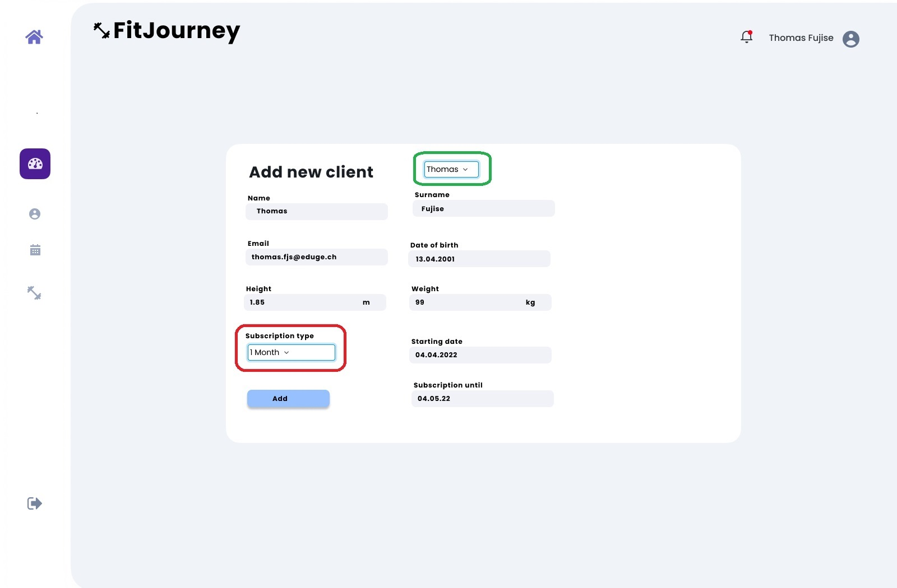

La page ajout de client permet au coach d'effectuer la prise en charge d'un nouveau client. Si le client possède déjà un compte, le coach peut séléctionner un compte déjà existant (en vert) ou créer un nouveau compte client. 

Si le coach séléctionne un compte déjà existant les champs se remplisse automatiquement. Il faudra uniquement séléctionner le type d'abonnement souhaité (en rouge)

##### Page profil client


La page profil client permet au coach de visionner le profil de ses clients (en bleu). Plusieurs boutons sont disponibles :

* 1 bouton pour le changement de la carte de membre (Bouton bleu)
* 1 bouton pour le renouvellement de l'abonnement (Bouton vert)
* 1 bouton pour l'annulation de l'abonnement (Bouton rouge)

Il peut également voir les graphiques/statistiques disponibles sur le profil.

Le coach peut ajouter les nouveaux programmes du client (en rouge) à l'aide des boutons d'importation (1 bouton pour le programme d'entrainement et 1 bouton pour le programme de nutrition). Les anciens programmes sont disponibles en cliquant sur les boutons du programme souhaité (bouton vert et orange), leurs dates d'importation sont affichées à côté.

Dans la zone verte, on peut retrouver les différents bilan de satisfaction que le client a ajouté. En haut de cette zone, un bouton d'ajout de bilan est disponible. Il va permettre d'effectuer le bilan du client et d'ajouter les nouvelles informations (Poids, Masse graisseuse, etc)

##### Page Bilan client
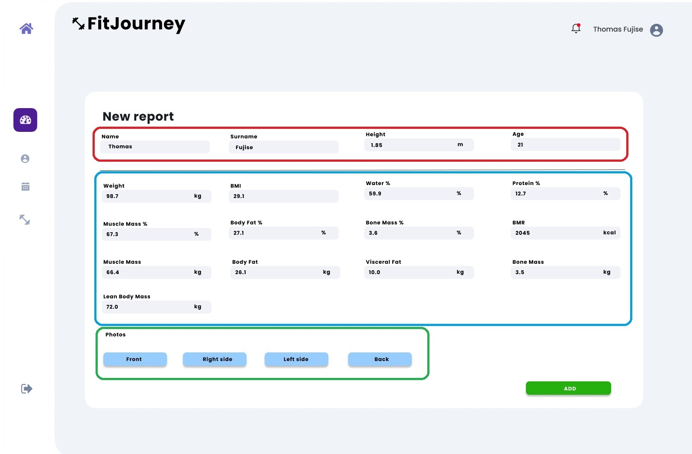


La page Bilan client permet au coach d'ajouter le bilan d'un client.

Dans la zone rouge, on retrouve les infos qui changent le moins voire jamais (Nom, taille ou encore l'âge).

Dans la zone bleue, les informations importantes qui ont pu être récupérées suite à la pesée.

Dans la zone verte, il est possible d'ajouter des photos du physique du client pour pouvoir éventuellement avoir des avant/après en guise de comparaison.

##### Page Abonnement


La page abonnement permet de valider le paiement d'un client (Aucune transaction n'est effectué par l'application). Le coach peut séléctionner le type d'abonnement que le client souhaite prendre, la date d'échéance du nouvel abonnement séléctionné ainsi que son coût seront affichés.

##### Page Calendrier


La page calendrier permet au coach d'avoir accès à un calendrier et de visionner les rendez-vous enregistré à la date séléctionné. Les sessions enregistrés sont affichés dans la zone rouge, avec quelques détails sur la séance.

Dans la zone verte, un bouton pour ajouter une nouvelle session avec un client est disponible. Le coach doit renseigner :

* Le nom du client (Liste déroulante parmis ses clients)
* L'heure de la session
* La durée
* Le type de session 


## Analyse Organique


### Mise en place / Envirronement

#### Visual Studio Code
J'ai choisi d'utiliser Visual Studio code pour éditer mon code, il est directement relié à mon repo sur Github. Je peux donc directement depuis Visual Studio Code commit tous les changements que j'effectue.

#### Mkdocs 
Mkdocs permet de générer un site statique pour la documentation. Il prend en compte tous les fichiers Markdown (.md) dans le dossier *docs/*, et un fichier de configuration YAML qui se trouve à la racine du projet. Mkdocs me permet de visionner mes fichiers Markdown en direct et à l'aide de l'extension *with-pdf*, de générer un fichier PDF de me tous mes fichiers Markdown.

#### GitHub
{width=200 align="right"}

Pour pouvoir garder un suivi constant de mon projet, j'ai choisis d'utiliser GitHub comme outil de contrôle de version.

Voici comment est structuré le github :


* Le dossier docs/ contient les fichiers de documentation et de journal de bord
* Le dossier src/ contient tout le code source de l'application
 
#### Trello
{width=200 align="right"}

Trello est un outil de gestion de projet en ligne, inspiré par la méthode Kanban. Il repose sur une organisation des projets en planches listant des cartes, chacune représentant des tâches. 

Afin de créer une roadmap pour mon projet, j'ai utilisé Trello pour lister les différentes étapes de mon projet. J'ai ensuite pu définir les échéances pour chaque tâches/étapes avec mon planning prévisionnel.

J'ai créé 5 colonnes :

* Backlog (Liste de toutes les tâches)
* To-Do (Les tâches qui ont été validées et qui sont à faire)
* Doing (Les tâches en cours)
* Testing (Les tâches en cours de test)
* Done (Les tâches terminées)

#### Guide d'installation 
FitJourney utilise la 3ème version de Python (donc `python3`)

##### Windows
Premièrement, cela serait intéressant de travailler sur un envirronement WSL avec VSCode. Pour mettre en place WSL, j'ai suivi le guide disponible directement dans la documentation de VSCode : [https://code.visualstudio.com/docs/remote/wsl](https://code.visualstudio.com/docs/remote/wsl)

##### MySQL
Une fois l'envirronement de développement installé correctement, il faut installer MySQL (si cela n'est pas déjà fait) à l'aide de la commande :

`sudo apt install mysql-server`

Puis lancer le service MySQL:

`sudo service mysql start`

et 

`sudo mysql_secure_installation`

Pour se connecter à la base de données, utiliser un DBMS comme *DBeaver* ou *MySQLWorkbench*.

##### `pip3`
Il faut s'assurer que pip3 a bien été installé afin de télécharger tous les paquets/librairies pour faire fonctionner l'application comme il faut.

`sudo apt install python3-pip`

Si une erreur survient, utiliser la commande :

`sudo apt update && sudo apt upgrade`

Sinon, vous pouvez vérifier que pip3 a bien été installé en utilisant : 

`pip3 --version`

##### Pyscard 
Pour pouvoir installer la librairie `pyscard` sur Windows, il faut au préalable installer [SWIG](#swig) depuis le lien suivant : [https://www.swig.org/download.html](https://www.swig.org/download.html)

Il faut ensuite l'ajouter directement au PATH en modifiant les variables d'envirronement dans les propriétés système.

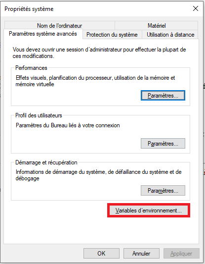

On peut ensuite ajouter simplement le chemin vers le dossier `swig` que l'on a téléchargé :

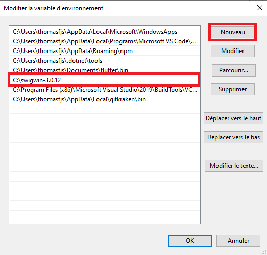

Une fois ajouté, il faut ensuite installer Visual C++ version 14.0 ou plus récente (directement installable depuis le Visual Studio Installer) ([https://visualstudio.microsoft.com/fr/downloads/](https://visualstudio.microsoft.com/fr/downloads/))

##### Requirements
Une fois que `swig` a été ajouté au PATH et que `pip3` a été installé, il faut installer tous les paquets nécessaires pour l'application. Un fichier `requirements.txt` contenant toutes les librairies nécessaire est disponible dans le dossier *src/*

`pip3 install -r requirements.txt`

/!\ Ne pas toucher ce fichier.

##### API 
L'API utilisée est l'API Accesslink v3.144.0 de Polar [https://www.polar.com/accesslink-api/#polar-accesslink-api](https://www.polar.com/accesslink-api/#polar-accesslink-api).

Pour pouvoir utiliser l'API, il faut disposer au préalable d'un compte Polar Flow [https://flow.polar.com/](https://flow.polar.com/).

###### Création d'un nouveau client pour l'API
Aller sur [https://admin.polaraccesslink.com/](https://admin.polaraccesslink.com/). Il faut se connecter avec votre compte Polar Flow et ajouter un nouveau client. Il faut utiliser `http://localhost:5000/oauth2_callback` pour la callback d'authorisation.

###### Configuration des identifiants
Ajouter l'`id` et le `secret` client dans le fichier `src/cardsChecker/config.yml` comme ceci : 

```
client_id: 57a715f8-b7e8-11e7-abc4-cec278b6b50a
client_secret: 62c54f4a-b7e8-11e7-abc4-cec278b6b50a
```
 
###### Authentification
Le compte utilisateur doit être relié au client créé avant de pouvoir accéder aux données. Pour le relier il faut lancer le script `src/cardsChecker/authorization.py`

```
python3 authorization.py
```

puis aller sur la page '[https://flow.polar.com/oauth2/authorization?response_type=code&client_id=CLIENT_ID](https://flow.polar.com/oauth2/authorization?response_type=code&client_id=CLIENT_ID)' pour relier votre compte utilisateur. ('*CLIENT_ID*' doit être remplacé par votre id client)

Une fois ces étapes effectuées, votre compte aura accès aux données Polar.
##### Base de données
Pour la base de données, il suffit de créer un base nommée `fitjourney`, (respcter le nom sinon l'application ne fonctionnera pas). Vous pouvez ensuite exécuter le script sql disponible à `src/apps/db.sql`.


### Organisation / Gestion du temps
#### Convention : en-têtes
Tous les fichiers développés par moi même possèdent l'entête ci-dessous:

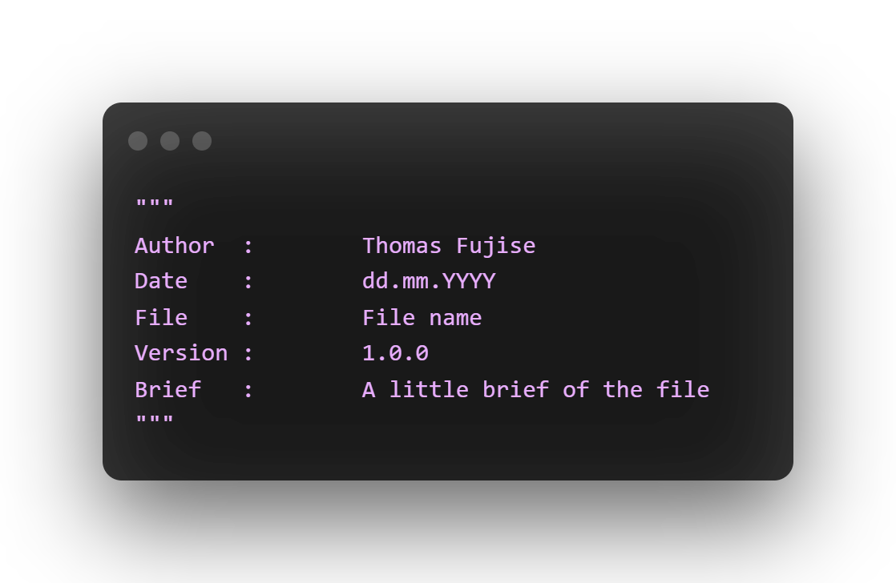

#### Backlog
Les backlogs ont été identifiés au lancement du projet (certains l'ont été au fur et à mesure que le projet avançait). Ils ont été ajouté au [Trello](#trello) qui est l'outil qui a été choisi pour gérer le projet. Avec les cartes Trello, j'ai défini la difficulté et la priorité des tâches. Il était donc plus simple pour moi de visualiser quelle tâches devaient être réalisé en priorités.

##### Difficulté
La difficulté est définie par une étiquette de couleur selon la charte que j'ai défini : 

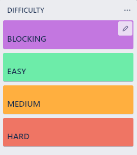

##### Priorité
La priorité est définie également par une étiquette qui provient de l'extension "CardsPriority" sur Trello. Les prioritées assigné suivent la charte : 

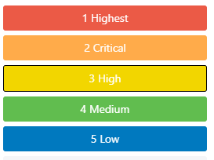

#### Planning 
Un planning prévisionnel a été réalisé au début du projet afin de lister les tâches et d'estimer leurs durées. En regardant les graphiques, on peut directement apercevoir que les deux n'ont aucun point en commun.

Planning prévisionnel : 


Planning effectif : 
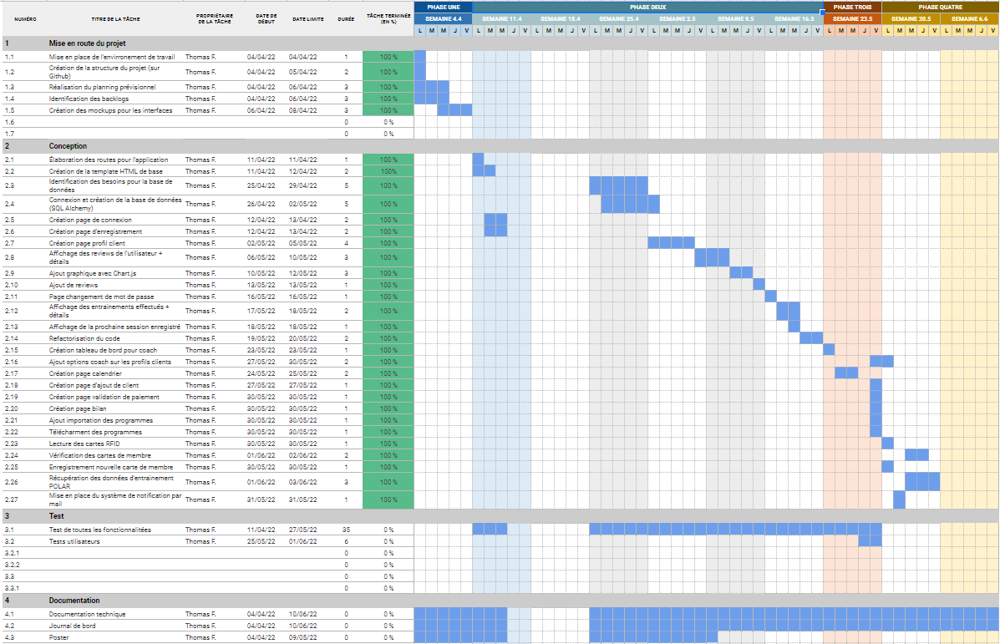

Lors de la réalisation du projet, beaucoup de tâches sont venues s'ajoutées. Toutes la mise en place de la structure de l'application avec Python Flask m'a prit beaucoup plus de temps que prévu. Les besoins de la base de données qui ont été revu a maintes reprises.

Le planning initial n'a vraiment pas pu être respecté a cause des différentes tâches qui ont été identifiées uniquement après avoir commencer le projet.

### Technologies utilisées

#### NFC Reader ACR122U

Le lecteur NFC ACR122U est un appareil permettant de lire et d'écrire sur des cartes sans contact. Il est basé sur la technologie Mifare 13,56 MHz (RFID) et suit les standards de la norme ISO 18092. L'ACR122U est développé et vendu par ACS ltd .

Pour pouvoir utiliser ce lecteur, j'ai utilisé la librairie *pyscard* qui me permet de récupérer les infos des cartes à puces que le lecteur lit

{ width="300" }

##### RFID
**Qu'est-ce que la technologie RFID ??**
 
RFID (Radio Frequency Identification), est une technologie qui permet d'enregistrer des données sur un support et de les récupérer à distance. Elle est apparue dans les années 1940 et était utilisée uniquement par l'armée pour l'identification des avions de guerre qui entrait dans l'espace aérien du Royaume-Uni. Elle s'est ensuite répandue dans différents secteurs industriels à partir des années 1980.
  
**Comment fonctionne la RFID ?**

Les étiquettes RFID, sont composées d'une puce RFID et d'une antenne et sont collées sur un produit. Elles enregistrent les données et avec un lecteur électromagnétique on peut ensuite lire les ondes radio présentes sur la puce RFID grâce à l'antenne.
 
**Pourquoi utiliser RFID**

RFID est un système de traçabilité. A l'aide d'une seule puce, il est possible de tracer les produits pendant tout le processus de production, de transport et de distribution, voire même jusqu'à leur fin de vie.

Dans le cadre de mon projet, RFID est une solution adéquate pour gérer les entrées/sorties des clients dans la salle d'entrainement.

**Différences entre RFID et NFC**

{ width="500"}

Dans le cadre de mon projet, j'utilise parfois le terme NFC. La technologie NFC (Near Field Communication) est un dérivé de la RFID qui a commencé à être utilisé dès 2011. Le NFC repose sur le même concept que la RFID. C'est une technologie qui fonctionne avec une puce permettant d'échanger des données entre un lecteur et n'importe quel terminal avec un simple rapprochement ou contact entre les deux objets.

La communication sans fil ne fonctionne qu'à courte portée et haute fréquence, une distance d'environ 10cm. La technologie NFC se retrouve dans la plupart des smartphones, consoles de jeux ou cartes bancaires. Le lecteur de carte que j'utilise fonctionne à l'aide de cette technologie également.

Les principales différences entre RFID et NFC résident dans la portée plus courte et sécurisée pour NFC (10cm) contre jusqu'à 10m pour RFID. La technologie NFC peut transmettre toute sorte de données contre RFID qui ne transmet que l'ID. La lecture fait, quant à elle, défaut à la technologie NFC qui ne peut lire qu'une puce à la fois ce qui peut limiter ses cas d'utilisation.


#### Pyscard - Librairie Python Smart card 

Pyscard est un module python qui permet d'utiliser les cartes à puce (PC/SC) avec python. Il donne accès à plusieurs classes et fonctions donnant accès aux cartes et aux lecteurs.  

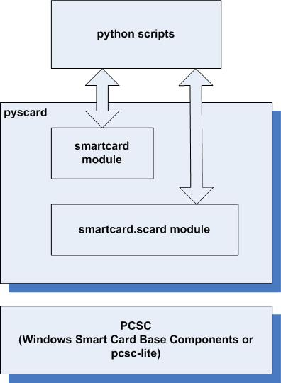{width="250"}

Architecture pyscard :

* smartcard.scard est un module d'extension enveloppant l'API WinSCard (Les composants de base smartcard) aussi connue sous le nom PC/SC (Personal computer / Smart Card)
* smartcard est un framework Python construit à partir de l'API PC/SC


#### SWIG


SWIG est un outil logiciel open source qui permet de connecter des logiciels ou librairies écrites en C/C++ avec des langages de scripts tels que : *Perl*, *Python*, *Ruby*, *PHP* ou d'autres langages de programmation comme *Java* ou *C#*.

#### Polar Accesslink API 
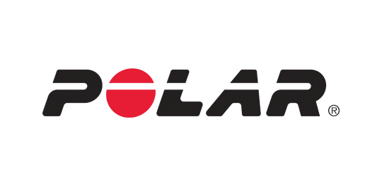

Accesslink est une API qui donne accès aux données d'entrainement et d'activitée journalière enregistrés par les appareils Polar. Pour pouvoir l'utiliser il est nécessaire de posséder un compte Polar Flow afin de créer un client sur [admin.polaraccesslink.com](admin.polaraccesslink.com) qui nous donnera accès à l'API. 

Accesslink utilise [OAuth2](https://oauth.net/) comme protocole d'authentification. Les utilisateurs enregistrés ont besoin de s'authentifier pour pouvoir avoir accès aux données.


Fonctionnalités de base d'Accesslink :

| Fonctionnalité        | Description                                            |
| ----------------------| ------------------------------------------------------ |
| Utilisateurs          | Permets d'enregistrer, supprimer et récupérer les informations de base de l'utilisateur        |       
| Pull Notification     | Permets de vérifier si l'utilisateur à des données disponible à récupérer | 
| Donnée d'entrainement | Permets d'accéder aux données d'entrainements de l'utilisateur |
| Activité journalière  | Permets d'accéder aux données de l'activité journalière de l'utilisateur |
| Info physique         | Permets d'accéder aux informations physique de l'utilisateur (Ex: Taille/Poids) |
| Modèle de données     | Décrit tous les objets qui transportent les données entre le serveur et le client |
| Annexes               | Contient des exemples et des détails sur l'interface de l'application |    

##### Choix dans le projet - FitJourney
Je souhaitais utiliser les données d'entrainements en provenance de montre connectée et j'avais déjà en ma possession une montre Polar. Mon choix s'est donc naturellement orienté vers Polar, lorsque j'ai pris connaissance de l'API développée en Python qu'ils mettaient à disposition. 

#### Python 
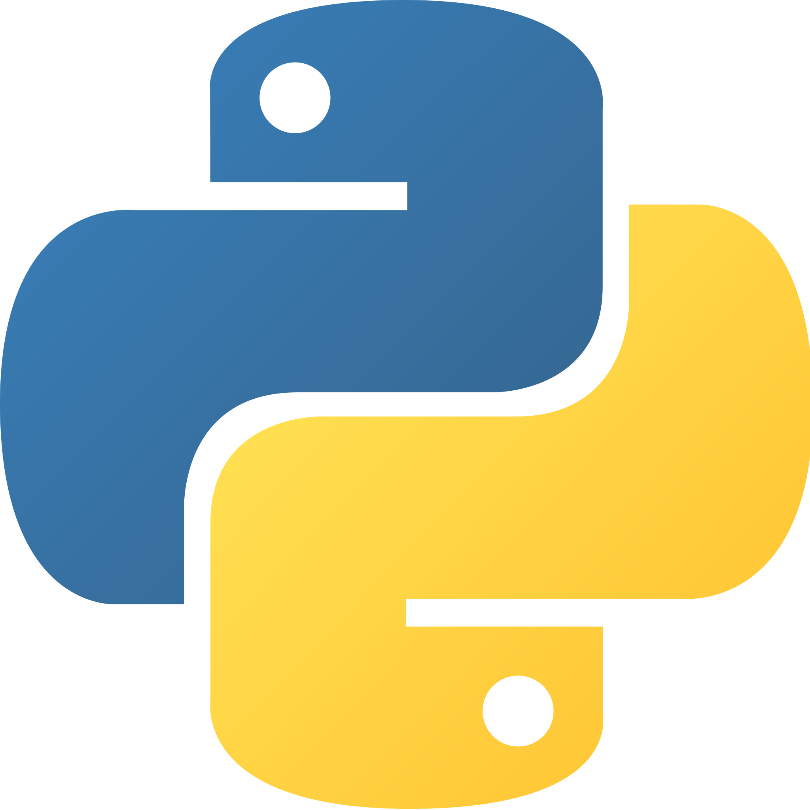{width=200 align="right"}

Python est un langage très flexible qui propose une approche modulaire et orientée objet de la programmation. Il est placé sous une licence libre et fonctionne sur la plupart des plates-formes informatiques. Il est conçu pour optimiser la productivité des programmeurs en offrant des outils de haut niveau et une syntaxe simple à utiliser.

##### Choix dans le projet - FitJourney

Durant ma dernière année en tant que Technicien ES, j'ai beaucoup utilisé python dans mes projets. En trouvant de plus en plus d'outils comme la librairie *pyscard* ou encore l'API Polar en Python, je me suis très vite décidé sur le langage que j'allais utiliser pour ce projet.

#### Python Flask (backend)
Flask est un micro-framework Python qui permet la création d'applications web évolutives. Flask dépend de la boite à outils WSGI (Web Server Gateway Interface) de [Werkzeug](https://werkzeug.palletsprojects.com/en/2.0.x/) et du moteur de templates [Jinja](https://jinja.palletsprojects.com/en/3.0.x/). Le dossier *app/* représente une application Flask, elle est entre-autre homogène à une fonction WGSI.

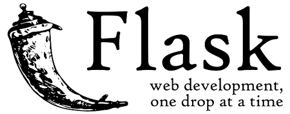

##### Utilisation Flask
Pour lancer une application Flask, il faut utiliser la méthode de l'objet Flask : 
```
.run()
```
ou lancer directement l'application à l'aide de la commande : 
```
Flask run
```

##### Micro framework
Un micro framework est un framework qui tente de fournir uniquement les composants absoluments nécessaires à un développeur pour la création d'une application. Par exemple dans le cas d'une application Web, un micro framework peut être spécifiquement conçu pour la construction d'API pour un autre service/application.

Le terme *micro* dans le micro framework signifie que Flask vise à garder le code de base simple mais extensible. Flask ne prendra pas beaucoup de décisions, par exemple quelle base de données utiliser. Les décisions qu'il prend, telles que le moteur de templates à utiliser, sont faciles à modifier. Tout le reste est libre, de sorte que Flask puisse répondre à tous nos besoins et à tous ce que vous ne voulez pas en même temps.

En définissant uniquement le moteur de templates et un système de routes, Flask laisse le choix de personnaliser (en ajoutant des packages) pour la gestion des formulaires par exemple.

##### Choix dans le projet FitJourney
Dans le cadre de ce projet, j'ai préféré utiliser Flask comme framework à la place d'un autre car j'utilise l'API Polar Accesslink qui est fait en Python. Je souhaitais garder le même langage pour éviter de partir dans tous les sens.

##### Architecture (Blueprint)
Afin de bien structurer mon projet, j'ai décidé d'utiliser les Flask Blueprint. Chaque Flask Blueprint est un objet et fonctionne de manière très similaire à une application Flask. Ils peuvent tous les deux avoir des ressources, comme des fichiers statiques, des templates et des vues qui sont associés aux routes.

Malgré tous, un Flask Blueprint n'est pas exactement comme une application Flask car il a besoin d'être enregistré dans l'application pour être lancé. Lorsqu'on enregistre un Blueprint à l'application, on étend l'application avec le contenu du Blueprint. Les Blueprints enregistrent toutes les opérations à exécuter et ne les exécutes qu'une fois enregistré dans l'application

Les Blueprints m'ont permis de découper l'application principale en plusieurs parties et de structurer mon projet.

#### Argon Design System
{width=200 align="right"}

Argon est un "design system" open source basé sur le framework CSS Bootstrap 4. Il propose plus de 100 composants individuel ce qui permet une certaine libertée. 
Argon m'a permit de ne pas perdre trop de temps sur le côté "design" de l'application

#### Chart.JS
{width=200 align="right"}

Chart.js est une librairie open source, elle permet la visualisation de données en utilisant JavaScript. Elle est similaire à *Chartist* ou *Google Chart*. Chart.js supporte 8 différents type de graphique et sont tous responsive. Pour pouvoir utiliser Chart.js il faut :

* Definir ou dessiner le graphique sur notre page
* Definir quel type de graphique afficher
* Definir les données, labels et toutes les autres options

Voici un exemple de graphique que peut générer chart.js : 
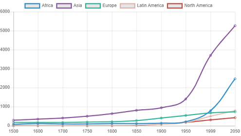

#### FullCalendar.io
{width=200 align="right"}

FullCalendar est une librairie javascript qui s'intègre facilement avec des frameworks Javascript populaires tels que Vue, React et Angular. Elle permet d'implémenter un calendrier avec des événements. Cette librairie est très utile pour gérer l'agenda du coach.

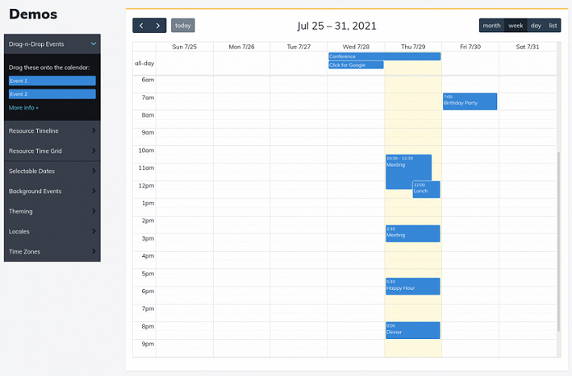

### Architecture du projet
Voici l'architecture du projet Fitjourney : 

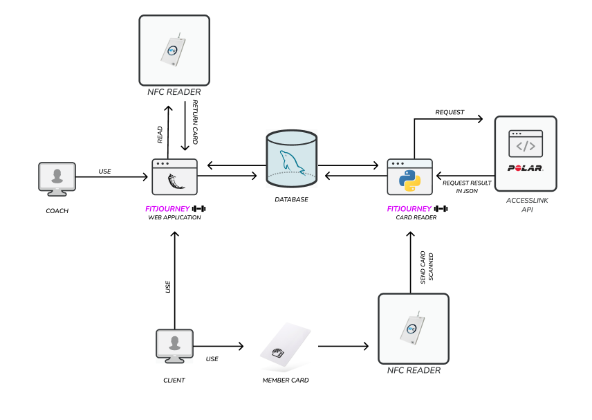

#### Arborescence application principale
```
run.py
|
apps/
|
|── __init__.py
├── config.py
|
├── authentication/
|   ├── __init__.py
|   ├── forms.py
|   ├── models.py
|   ├── routes.py
|   └── util.py
|
├── client/
|   ├── __init__.py
|   ├── forms.py
|   ├── routes.py
|   └── util.py
|
├── coach/
|   ├── __init__.py
|   ├── forms.py
|   ├── routes.py
|   └── util.py
|
├── static/assets/
|   ├── css/
|   ├── fonts/
|   ├── img/
|   ├── js/
|   └── vendor/.py
|
└── templates/
    ├── accounts/
    ├── client/
    ├── coach/
    ├── includes/
    └── layout/


```

##### Fichier "run.py"
Le fichier run.py est le seul fichier qui est en dehors du dossier principal de l'application. Il permet de créer et de lancer l'application Flask. On peut lancer directement l'application en exécutant ce script.

```
python3 ./run.py
```

##### Dossier "Apps"
Le dossier *Apps* est le dossier principal de l'application. Il comprend l'ensemble du code source du projet excepté le fichier "run.py". Il comprend lui-même plusieurs sous-dossiers expliqués dans les chapitres suivants.

###### Dossier "authentication"
Le dossier *authentication* représente le Blueprint *authentication_blueprint*. On retrouve tous les fichiers utilisés pour l'implémentation des fonctionnalités d'authentification. Avec Flask, j'implémente un ORM nommé SQL Alchmey qui implémente le design pattern *Data Mapper* pour lire les données de la base de données. Chacune des tables est représentée par un modèle qui est utilisé pour interagir avec la table en question.

Sachant que l'application *FitJourney* n'a pas de fonctionnalités disponible avant que l'utilisateur ne s'authentifie, le fichier "models.py" se trouve dans ce dossier, on y retrouve notamment tous les modèles.

###### Fichier "authentication/routes.py"
Le fichier *routes* contient des fonctions python représentant les *vues* de la partie authentification de l'application. Chaque fonction permet de générer une vue à partir des templates Jinja2, à l'aide de la fonction Flask *render_template* qui provient du package *Flask.templating*.

###### Dossier "client"
Le dossier *client* représente le Blueprint *client_blueprint*. On retrouve tous les fichiers utilisés pour l'implémentation des fonctionnalités client. 
Il contient un fichier de routes, avec toutes les routes disponible en tant que client sur l'application et un fichier "forms.py" qui contient tous les fomulaires qui peuvent être disponible en tant que client.

###### Dossier "coach"
Le dossier *coach* représente le Blueprint *coach_blueprint*. On retouve tous les fichier utilisés pour l'implémentation des fonctionnalités coach. Comme le dossier "client" il contient également un fichier de routes et un fichier "forms" pour les formulaires.

###### Dossier "static/assets/css"
Le dosssier "css" contient tous les fichiers CSS de l'application. Il contient également un dossier "bootstrap" contenant des fichiers de style de l'ensemble Bootstrap

###### Dossier "static/assets/fonts"
Le dossier "fonts" contient les fichiers de police d'écriture utilisés dans l'application

###### Dossier "static/assets/img"
Le dossier "img" contient toutes les images de l'application dont notamment les photos de profil des utilisateurs.

###### Dossier "static/assets/js"
Le dossier "js" contient tous les fichiers JavaScript nécessaire pour l'application.

###### Dossier "static/assets/vendor"
Le dossier "vendor" contient toutes les bibliothèque tierce qui sont nécessaire au projet (ressources externe). C'est généralement dans ce dossier ou sont stocker les dependance à télécharger avec un packet manager.

###### Dossier "templates"
Le dossier templates est structuré en plusieurs parties. Il contient les fichiers .html de l'application. Chaque Blueprint de l'application possède son dossier ici qui contient les templates nécessaire pour les vues. En plus des dossiers représentant les Blueprints, un dossier includes est disponible. Il contient les parties à inclure sur les différentes pages de l'application comme la barre de navigation ou encore les importations de fichiers CSS ou JavaScript. Il y a également un dossier layout qui contient un fichier de base .html qui contient la structure HTML de l'application.

##### Fichier "__init.py"
Le fichier "init" est un fichier python contenant les méthode d'initialisation de l'application. C'est notamment ici que les blueprints sont enregistrés dans l'application.

##### Fichier "config.py"
Le fichier "config" est un fichier python contenant la configuration de l'application. Il contient toutes les constantes nécessaire au fonctionnement de l'application

#### Arborescence lecture de carte 

```
cardsChecker/
|
|── accesslink/
|
├── accesslink_polar.py
|   
├── authorization.py
|
├── config.py
|
├── config.yml
|
├── db.py
|
├── main.py
|
└── utils.py

```
##### Dossier "accesslink/"
Le dossier "accesslink" contient tous les scripts python permettant l'authentification, l'exécution des différentes transactions et récupérer des données avec l'API Polar Accesslink. La plupart des fichiers présents dans ce dossier sont fournit par Polar.

##### Fichier "accesslink_polar.py"
Le fichier "accesslink_polar" contient un objet Python qui enveloppe toutes les fonctionnalités de l'API Polar à l'aide des objets et méthode disponible dans le dossier "accesslink/"

##### Fichier "authorization.py"
Le fichier "authorization" est un script python qui permet d'authentifier un compte Polar pour avoir accès à l'API

##### Fichier "config.py"
Le fichier "config.py" contient toutes les constantes nécessaire pour le bon fonctionnement de la lecture des cartes de membre. On y retrouve notamment la configuration pour se connecter à la base de données.

##### Fichier "config.yml"
Le fichier "config.yml" contient la configuration du client pour avoir accès aux données avec l'API Polar. Il Contient :
 
* L'id de l'utilisateur 
* L'id du client (Pour l'accès)
* Le secret du client 
* Le token d'accès (Il est généré avec le fichier *authorization.py*)

##### Fichier "db.py"
Le fichier "db.py" est utilisé pour se connecté à la base de données, on y retrouve également les fonctions effectuant des actions avec cette dernière.

##### Fichier "main.py"
Le fichier "main.py" contient le script python principal qui permet la lecture des cartes et la récupération des données avec l'API Polar. C'est ce script qu'il faut exécuter pour lancer le programme.

### Base de données
Pour permettre le stockage des données, j'ai créé une base de données nomées "fitjourney". Cette base de données me permet d'enregistrer et stocker toutes les données requis pour le bon fonctionnement de l'application. 
#### MCD
Au lieu de créer la base de données directement, j'ai commencer par créer un MCD pour définir tous les besoins de l'application au niveau de la base de données. Pour faire mon MCD, je suis allé sur LucidChart qui est une plateforme de collaboration en ligne permettant la création de diagrammes et la visualisation de données et autres schémas conceptuels.


#### Modèle physique
Une fois les besoins identifiés à l'aide du MCD, j'ai pu utiliser SQL Alchemy pour créer ma base de données directement. 

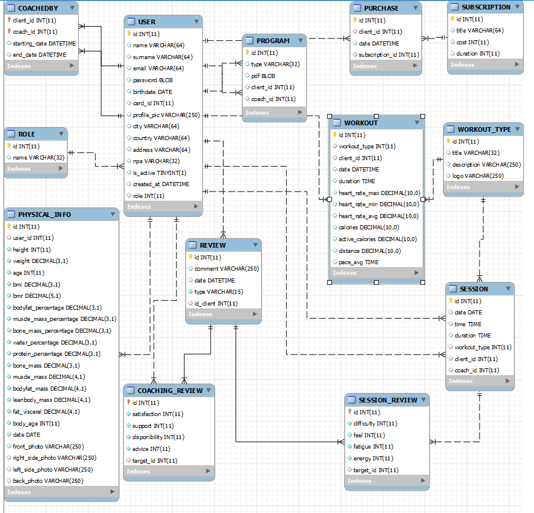
#### SQLAlchemy
SQL Alchemy est un ORM (mapping objet-relationnel) écrit en Python, il utilise le pattern [Data Mapper](#data-mapper) et me permet de créer directement mes tables.

Exemple d'initialisation d'une table avec SQL Alchemy : 


#### Data Mapper 
Data Mapper est un pattern qui sépare les objets en mémoire de la base de données. Il consiste à transférer les données entre les deux et à les isoler l'une de l'autre. Avec le pattern *Data Mapper*, les objets en mémoire ne doivent même pas savoir qu'une base de données est présente, ils n'ont pas besoin de code d'interface SQL, et certainement pas de connaissance du schéma de la base de données. (Le schéma de la base de données ignore toujours les objets qui l'utilisent). 


#### Tables

##### Table *USER*
La table *USER* contient tous les utilisateurs de l'application, les coachs ainsi que les clients. les champs *email* et *card_id* sont uniques. Le champ *card_id* représente l'ID de la carte de membre (RFID) qui est attribuée à l'utilisateur.

##### Table *PHYSICAL_INFO*
La table *PHYSICAL_INFO* contient toutes les informations physiques récupérées par le coach lors d'un bilan ou d'une prise en charge. La date permet de garder un historique pour visualiser la progression du client. La plupart des données insérées dans cette table peuvent être récupérées à l'aide d'une balance connectée.

##### Table *COACHEDBY*
Cette table permet de différencier un coach d'un client et permet de retrouver tous les clients d'un coach. Les dates de début et de fin permettent de retrouver des anciens coachs/clients si plusieurs coachs travaillent dans la salle de sport.

##### Table *PROGRAM*
La table *PROGRAM* contient les programmes d'entrainement et de nutrition ajouté par un coach.

##### Table *ROLE*
La table *ROLE* contient tous les rôles de l'application. Elle permet de définir les accès que possèdent les utilisateurs.

##### Table *PURCHASE*
La table *PURCHASE* contient l'historique de toutes les transactions effectuées. Elle permet de retrouver le type d'abonnement que chaque client a souscrit.

##### Table *SUBSCRIPTION*
La table *SUBSCRIPTION* contient tous les différents types d'abonnement disponible. Elle permet de connaître la durée et le coût des abonnements souscrient par les clients.

##### Table *SESSION*
La table *SESSION* contient l'historique de toutes les sessions effectuées par les coachs avec la date et l'heure de la session ainsi que sa durée. Pour rappel, une session représente un rendez-vous avec un coach. Cela peut être pour un entrainement ou encore un bilan.

##### Table *WORKOUT_TYPE*
Cette table contient les différents type d'entrainement. Elle permet d'identifier les entraînements effectués par les clients.

##### Table *WORKOUT*
La table *WORKOUT* contient toutes les données d'entraînements des séances effectuées. La majorité des données sont obtenues à l'aide des capteurs sur les montres connectées. Les données contenues dans cette table permettent de vérifier l'efficacité et l'intensité de la séance et peuvent être utilisés pour des comparaisons.

##### Table *REVIEW*
La table *REVIEW* est la table "mère" des 2 tables : *COACHING_REVIEW* et *SESSION_REVIEW*. Elle permet de relier les reviews aux clients.

##### Table *COACHING_REVIEW*
Cette table contient tous les retours client sur le coaching effectué par le coach. Les champs disponibles ont la satisfaction, le support le coach lui apporte, la disponibilité du coach en cas de besoin et si le client souhaite continuer son suivi.

##### Table *SESSION_REVIEW*
Cette table contient tous les retours client sur les sessions qu'il effectue avec un coach. Les champs disponibles sont la difficulté, le ressenti de la séance, le niveau de fatigue à la fin de la séance et l'énergie que le client avait en arrivant.

### FitJourney application
#### Développement avec Python Flask
L'application web FitJourney est développé avec Python flask qui utilise Jinja2 pour le templating et Werkzeug pour faire la communication entre serveur web et application web.

##### Templating Jinja2
Le templating permet de créer des pages dynamiques en fonction des données fournient à la page. Dans le cas de l'application, cela permet d'afficher les données de l'utilisateurs connectés ainsi qu'afficher certaines parties en fonction du niveau d'accès de l'utilisateur.

##### Template de base 
Le concept très utile qui est la possibilité de créer une template parent. Pour illustrer cela, j'ai un fichier *add_program.html* qui va utiliser tout le contenu du fichier *base.html*, mais qui va ajouter certaines parties en plus, selon les instructions.

Voici un aperçu du fichier *base.html* et on peut y retrouver plusieurs instructions comme :
```

```
Ces instructions permettent d'insérer du contenu depuis un fichier enfant.
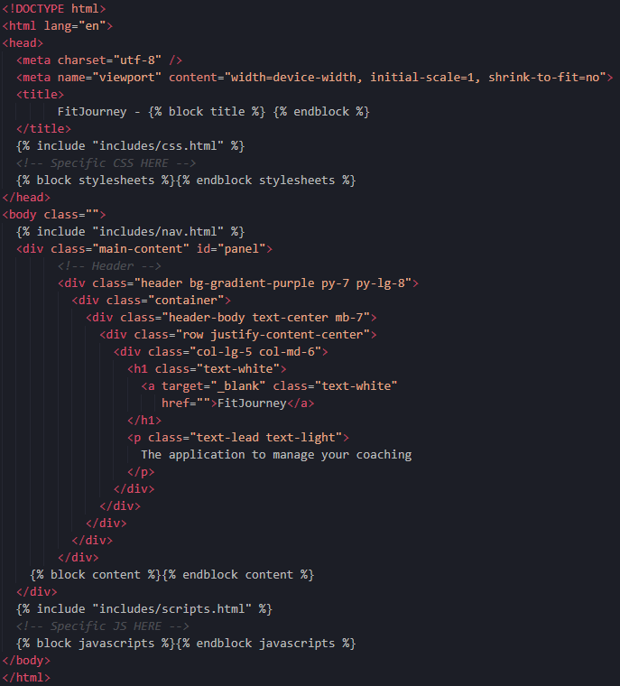

Pour créer un fichier enfant il suffit d'ajouter l'instruction : 
```

```
pour étendre le fichier de parent. Voici un exemple de fichier enfant avec le fichier *add_program.html* :

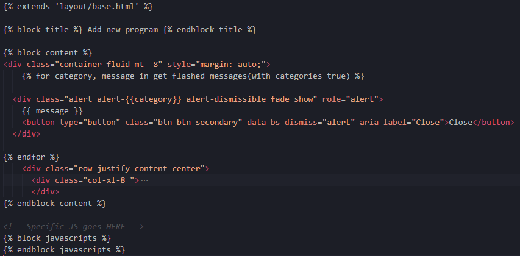

La vue de cette page : 

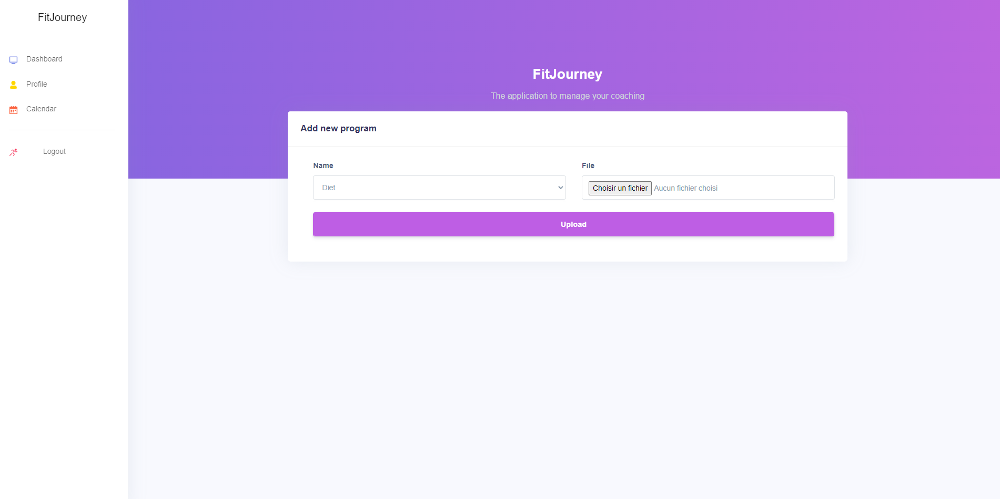


##### Routes
Les routes avec Python Flask sont reliées directement à des méthodes. Ces méthodes doivent forcément retourner quelque chose. L'instruction :
```
@blueprint.route('/dashboard')
```
permet de dire que la méthode qui suit l'instruction sera liée au blueprint et la route "/dashboard". (Il est possible de relier plusieurs routes à la même méthode)


Comme préciser ci-dessus, il est obligatoire de retourner quelque chose. Pour utiliser du templating Jinja2, Flask propose une méthode nommée *render_template()*. Le premier paramètres de cette méthode est le fichier de template que l'on veut utiliser, puis les paramètres suivant sont des données que l'on veut transmettre à la vue. Dans le cas de la route */dashboard*, je donne le prochain client qui a rendez-vous avec le coach, la date du dernier entrainement qu'il a effectué ainsi que la liste de tous les autres clients dont il a la charge.

Comme on peut le voir sur l'image ci-dessus, il est possible d'ajouter l'instruction 
```
@login_required
```
avant la méthode pour préciser que cette route n'est accessible que si un utilisateur est connecté. Cette instruction est utilisable à l'aide la librairie *Flask-Login*.


##### Les routes de l'application
Comme mentionné plus haut dans l'[architecture blueprint](#architecture-blueprint), dans mon application, chaque route est reliée au blueprint correspondant. Voici les différentes routes qui ont été créé pour l'application *FitJourney*.

Endpoint public - Visiteur

| Méthodes  |  Endpoint   | Description  | 
|---|---|---|
| POST | /login  | Permet de connecter un utilisateur |    
|---|---|---|

Endpoint privé - Client

| Méthodes  |  Endpoint |  Description  | 
|---|---|---|
| GET | /index  |  Récupère les prochaines sessions que le client a planifié |   
| POST | /profile | Récupère toutes les données du client, permets de modifier les informations personnelles du client   |   
| GET | /review |  Récupère les détails d'une review |   
| POST | /add_review | Permet d'ajouter une review  |   
| GET | /workouts | Récupère tous les entrainements effectué par un client   |   
| GET | /workout | Récupère les détails d'un entrainement  |   
| GET | /checkup | Récupère les détails d'un bilan  |   
| POST | /change_password |  Permet de modifier le mot de passe de l'utilisateur |   
| GET | /program |  Permet de télécharger le fichier pdf du programme |   
|---|---|---|

Endpoint privé - Coach

| Méthodes  |  Endpoint | Description  | 
|---|---|---|
| POST | /register |  Permet d'inscrire un nouvel utilisateur **coach**|
| GET | /dashboard  | Récupère les informations de la prochaine session du coach et la liste de tous ses clients  |
| POST | /calendar | Récupère toutes les sessions d'un coach et permet d'ajouter une nouvelle session avec un client   |
| POST | /client |  Récupère toutes les données d'un client   |
| GET | /review |  Récupère les détails d'une review  |
| POST | /add_client | Permet de créer un nouvel utilisateur client  |
| POST | /add_program | Permet d'ajouter un programme à un client   |
| GET | /program | Permet de télécharger le fichier pdf du programme   |
| GET | /checkup |  Récupère les détails d'un bilan  |
| POST | /check_up | Permet d'ajouter un bilan   |
| POST | /new_subscription |  Permet de renouveller un abonnement  |
| POST | /new_card |  Permet de mettre à jour la carte membre d'un client  |
| POST | /cancel_subscription | Permet d'annuler l'abonnement d'un client  |
|---|---|---|


##### Client

###### Prochaines sessions

La page "prochaines session" de l'application a pour but d'afficher toutes les sessions à venir pour le client. Cela permet au client d'avoir une vue d'ensemble sur les différentes sessions qu'il a prévu avec son coach. Pour récupérer toutes les prochaines sessions j'utilise la méthode 
```
get_next_session(userid)
```
Elle se trouve avec toutes les autres méthodes utilisées pour les routes client, dans le fichier *client/utils.py*. Je n'ai besoin que de l'id du client dont on veut récupérer les sessions.

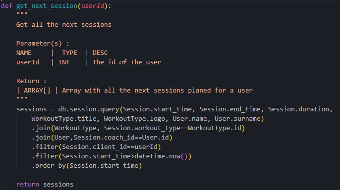

Le tableau retourné contenant toutes les sessions est ensuite envoyé à la vue à l'aide de la méthode *render_template()*


###### Profil

La page "profil" est une page qui est utilisé pour les 2 types d'utilisateurs, seulement plus d'informations sont affichés lorsque c'est un client qui est connecté. Cette page sert essentiellement à modifier ses informations personnelles à l'aide d'un formulaire. Beaucoup de données sont récupérées pour tout afficher sur cette page. La modification des données de l'utilisateur se fait à l'aide du model *SQLAlchemy* *User*. Ce qui rend la tâche beaucoup plus simple, en modifiant les propriétés correspondant aux champs modifiés on peut mettre à jours toutes les valeurs. Il suffit d'effectuer un commit à la fin pour valider les changements. Si l'utilisateur importe une nouvelle photo de profil, l'image est sauvegarder localement avec un nom unique et ce nom est enregistré dans la base de données. 


On peut voir ici que j'essaye de commit les changements effectués, je sauvegarde l'image importé et si cela fonctionne le fichier "profile.html" est retourné avec la méthode *render_template()*. Avec la méthode *flash()*, je peux afficher un message pour confirmer à l'utilisateur que la mise à jours a fonctionné ou pas.


###### Changement de mot de passe

La page "changement de mot de passe" est également accessible par les 2 types d'utilisateurs, elle est directement relié à la page profil. En précisant l'instruction suivante dans le lien de référence d'un bouton ou d'un lien on peut arriver directement sur cette page : 
```
{{url_for('client_blueprint.change_password')}}`

```
la méthode *url_for()* permet d'obtenir l'URL qui redirige vers une route ou un blueprint en l'occurence. 

Le changement de mot de passe s'effectue en précisant son ancien mot de passe, le nouveau ainsi qu'une confirmation pour éviter les fautes de frappe. L'ancien mot de passe est ensuite vérifier à l'aide de la méthode *verify_pass()* qui permet de comparer le mot de passe saisit avec celui hashé en base de données.


Pour effectuer la vérification, je prends les 64 premiers caractères qui correspondent aux salt. Je hash ensuite le mot de passe saisit avec le même salt puis je compare avec celui enregistré en base.

Si l'ancien mot de passe est correctement renseigné, alors la propriété *password* du model User est modifiée en hashant le mot de passe à l'aide de la méthode *hash_pass()*. Pour hashé le mot de passe j'utilise l'algorithme "SHA-512" sur le mot de passe ainsi que le salt qui est genéré.


Un message est ensuite affiché en fonction de la réussite de l'opération à l'aide de la méthode *flash()*

###### Entrainements

La page entrainements est la page qui permet au client de visionner l'ensemble des entrainements qu'il a effectué depuis son inscription.


J'utilise la méthode *get_workouts()* qui permet de récupérer tous les entrainements d'un client et je les passent ensuite à la vue avec la méthode *render_template()*


Les entrainements sont récupérer dans l'ordre par date décroissante (le plus récent en premier).


###### Entrainement

La page "entrainement" est utilisé uniquement pour afficher les détails d'un entrainements depuis la page "entrainements" d'un client. Les liens disponible sur la page "entrainements" qui permettent la redirection sur la page "entrainement" affichant les détails de ce dernier sont genérés avec l'instruction : 
```
{{ url_for('client_blueprint.workout', Id=workout.id) }}
```
En passant, un paramètre supplémentaire à la méthode *url_for* je peux passer des valeurs en paramètre. Je fais donc passer l'id de l'entrainements que je récupère ensuite sur cette page entrainement pour aller chercher les données correspondantes. J'utilise la méthode *get_workout_details()* qui me permet d'aller chercher toutes les informations nécessaires pour afficher les détails de l'entrainement en question.


Les données des entrainements sont récupérés avec l'[API Polar Accesslink](#polar-accesslink-api) qui donne accès aux enregistrements des montres connectés Polar.

###### Ajout de review

La page "Ajout de review" est un simple formulaire qui permet d'ajouter une review sur le coaching de manière générale ou sur un entrainement effectué. Le type de review ajouté est défini en fonction de ou le client va cliquer sur l'application. Les boutons redirigeant sur cette page possèdent un paramètre *type* qui permet d'identifier les champs a afficher ainsi que le type de review qui va être ajouté. Il y a également un paramètre target qui est ensuite inséré dans un input *hidden* représentant l'id de la "cible" de cette review.

Les reviews sur le coaching peuvent être ajouté n'importe quand, par contre, un entrainement ne peut posséder qu'une seule review. Pour ajouter une review, j'utilise le model SQL Alchemy *WorkoutReview* pour les reviews d'entrainements et *CoachingReview* pour les reviews de coaching. Il suffit de renseigner les propriétés avec les champs renseigner, et d'effectuer un commit pour valider l'insertion. 

Exemple avec une review d'entrainement :


###### Review

La page "Review" permet l'affichage d'une review que le client a ajouté. Les reviews ajoutés par le client sont listés sur son profil, il peut donc accéder aux détails de ces dernières en cliquant dessus. A nouveau à l'aide de la méthode *url_for* je fait passer en paramètre l'id et le type de la review séléctionné. Cela permet la récupération des infos une fois sur cette page. Les détails sont récupéré à l'aide de la méthode *get_review_details()* et sont ensuite passé en paramètre à la méthode *render_template()*.

###### Bilan

La page "Bilan" ressemble aux pages "Review" et "Entrainement" car elle ne sert qu'à afficher les valeurs qui ont été renseigné lors d'un Bilan avec le coach. L'id du bilan est passé en paramètre GET comme pour les deux autres pages (Review et Entrainement). Une fois récupéré, j'utilise la méthode *get_check_up()* en donnant l'id du bilan en paramètre pour avoir toutes les données et les passer ensuite en paramètre à la méthode *render_template()* qui les fera passer à la vue

##### Coach

###### Tableau de bord

 La page "Tableau de bord" permet d'afficher la prochaine session du coach ainsi que la liste de tous ses clients. Une vérification est effectué au début de la route pour éviter qu'un client se retrouve sur cette page.

 

 La vérification est effectué avec la méthode *is_coach()* de l'objet *User* qui permet de vérifier si l'utilisateur connecté possède le role de coach. Si l'utilisateur est un coach, alors les infos du prochain client, la date de son dernier entrainement ainsi que la liste de tous les clients dont le coach a la charge sont recupérés et donné en paramêtre à la vue.

###### Calendrier

La page "Calendrier" permet d'afficher un agenda affichant toutes les sessions que le coach a enregistré. Il peut également en ajouter une avec le formulaire qui est disponible juste à côté. Le calendrier est affiché à l'aide de la librairie Javascript *FullCalendar.io*, il est initialisé en javascript. Les événements à inscrire dans le calendrier doivent être assigné à la propriété *events:* de l'objet javascript *FullCalendar.Calendar()*. La méthode *get_session()* est donc utilisé pour récupérer tous les sessions enregistrés pour le coach connecté dans le bon format pour que les sessions soient interprêtés comme un événement pour le calendrier.


La méthode récupère toutes les sessions à venir et les ajoutent dans un tableau sous la forme d'objets avec 3 propriétées
```
{
    'title':
    'start':
    'end':
}
```

Si le coach ajoute une session à l'aide du formulaire, les valeurs des champs sont récupérés et utilisés pour avoir le format désiré. Si le coach n'a pas de client a charge, il ne sera pas en mesure de séléctionner un client pour la session qu'il souhaite ajouter. Si il essaye, une erreur sera affichée à l'aide de la méthode *flash()*. Le *DateTime* de fin est genéré automatiquement à l'aide de la date et l'heure de début séléctionné ainsi que la durée. Pour enregistrer sous le format *DateTime*, l'heure de la session est ajouté à la date.La session est ajoutée à l'aide du model SQLAlchemy *Session*, l'ajout est validé avec un commit.

###### Ajout client

La page "Ajout client" permet de créer un nouveau compte client et d'assigner son suivi au coach qui créer son compte. Cette page contient également une vérification avec la méthode *is_coach()* pour vérifier que l'utilisateur sur cette page est bien un coach. L'input de type *select* pour séléctionner le type d'abonnement souhaité est genéré automatiquement, les différents abonnements sont récupérés depuis la base de données avec la méthode *get_all_subscription()*. Pour ajouter le client dans la base de données, j'utilise à nouveau les modèles *SQLAlchemy*, cette fois-ci plusieurs sont nécessaires (*User*, *CoachedBy* et *Purchase*). Pour pouvoir effectuer l'insertion comme il faut, je commence par l'utilisateur puis j'utilise l'instruction : 
```
db.session.flush()
```
qui me permet d'obtenir l'id de l'utilisateur qui va être inséré (utilisé pour l'insertion avec les 2 autres modèles). Une fois les 3 modèles remplis et ajouté, j'effectue un commit pour valider les insertions.


###### Client

La page "Client" permet aux coach de visionner le profil d'un de leurs client. Toutes les données nécessaires sont récupérés depuis la base de données et envoyer à la vue. On y retrouve énormement de données comme sur la page profil du client.


Sur la template Jinja2, on retrouve énormement de condition comme par exemple pour les programmes d'entrainements qui peuvent ne pas avoir été importé par le coach :

```

```

Cela permet d'afficher quand même quelque chose même si il n'y a pas encore de valeurs qui a été ajouté en base.

###### Ajout programme

La page "Ajout programme" est également soumise à une vérification, pour éviter qu'un client arrive sur cette page. Pour ajouter un programme, il suffit de séléctionner le type et d'ajouter le pdf que l'on souhaite importer.Le pdf est lu avec la méthode python *read()* qui permet de retourner les bytes du fichier. Ils sont ensuite enregistrés dans la base de données dans un champ *LONGBLOB*.

Pour télécharger le programme, j'utilise la route "/program" et je passe en paramêtre GET l'id du programme. La route retourne la méthode python *send_file()* qui permet de télécharger un fichier. J'utilise également l'objet *BytesIO* qui permet d'écrire le fichier à partir des bytes qui ont été enregistré en base.


L'ajout de programme devait se faire par import de fichier excel sous format uniformisé à la base. Après plusieurs réflexions, j'ai décidé de changer cela en acceptant uniquement les pdf. Cela permet plus de liberté aux coachs et évitera de "casser" leurs habitudes si ils utilisent l'application. Les coachs peuvent garder leurs méthode de rendu pour leurs programmes et simplement importer les pdfs sur l'application.

###### Ajout Bilan
La page "Ajout bilan" ne contient qu'un formulaire pour ajouter les valeurs du bilan. Les valeurs demandées sont toutes récupérables à l'aide d'une balance connectée. L'id, le nom, prénom et l'âge du client sont récupérés et insérés automatiquement et sont statiques, le coach ne peut pas modifier ses informations. L'âge du client est calculé en fonction de sa date de naissance et la date d'aujourd'hui.


###### Modification de carte
La modification de carte de membre s'effectue depuis la [page client](#client-2). Une fois le bouton cliquer, la méthode *get_card_id()* est appelée. Elle va lire à l'aide du [Lecteur NFC](#nfc-reader-acr122u) une carte que le coach va scanner. Un timeout de 30 secondes est définis pour éviter d'attendre trop longtemps, si les 30 secondes sont écoulées et que le coach n'a pas présenté de carte alors une erreur *flash()* est affichée. La méthode *get_card_id()* utilise la librairie python [smartcard](#pyscard---librairie-python-smart-card) qui permet d'utiliser le lecteur. Si le lecteur détécte une carte, alors une connexion est établie. A l'aide de la transmission, je peux récupérer l'UID de la carte sous le format : 
```
[12, 123, 89, 09]
```
Je n'ai plus qu'a modifier ce format en string pour pouvoir l'insérer en base plus tard.

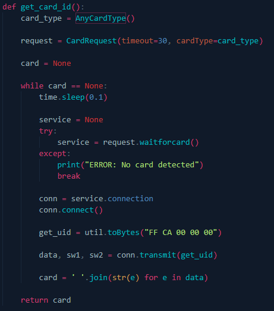


### FitJourney cards checker
#### Authentification à l'API

Comme expliqué plus haut dans la section [Entrainement](#entrainement), les entrainements sont récupérés à l'aide de l'API Polar. Pour s'authentifier envers l'API, j'utilise l'objet *Accesslink* qui utilise l'objet *OAuth2Client* qui est fournit par Polar afin de s'authentifier en utilisant le protocole OAuth2. Les identifiants sont quand à eux récupérés du fichier *config.yml*. Si les identifiants ne sont pas dans ce fichier, il faut alors exécuter le script *authorization.py* qui va se charger de générer et d'écrire les identifiants et le token d'accès dans le fichier *config.yml*.


#### Utilisation de l'API

Dans le dossier *endpoints/* on retrouve les objets python qui permettent d'effectuer les requetes à l'API. La principale requête que j'utilise est celle des "training data". C'est cette requête qui permet de récupérer les informations de l'entrainement enregistré avec les montres connectées. Les données sont récupérés en format json, voici un exemple de retour de cette requête : 

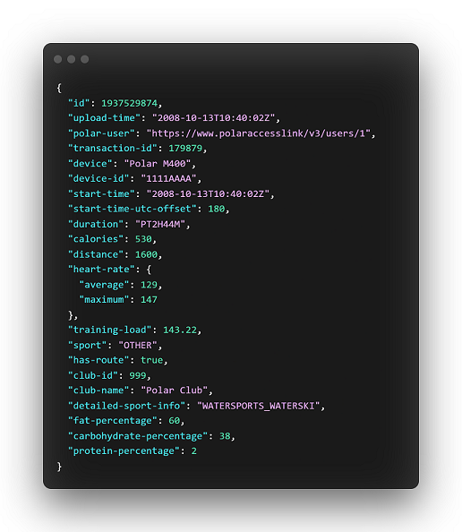

Les données récupérées sont pour la plupart dans le bon format, la durée de l'entrainement est malheureusement dans un format très spécial. La durée est représentée par un *string* commençant par "PT" et est suivi par les valeurs (heures,minutes, secondes). Chaque valeurs est suivi d'une lettre pour les séparés :
* La valeur pour les heures est suivie du caractère 'H'
* La valeur pour les minutes est suivie du caractère 'M'
* La valeur pour les secondes est suivie du caractère 'S'

Mais si il n'y a pas de valeur pour les heures par exemple, alors le caractère 'H' ne figurera pas dans le string.

J'ai donc effectué 3 conditions pour pouvoir bien formatter dans chaque cas le string avec la méthode *strptime* de la librairie *datetime* 

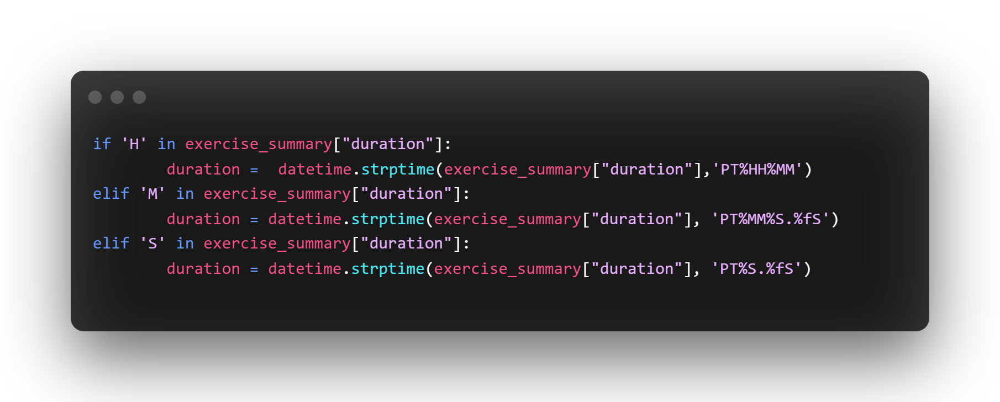

J'insère ensuite les données voulues dans la base avec la librairie *mysql.connector*.

## Tests

### Tests unitaires
Aucun test unitaire n'a été réalisé pour l'application. Cependant, toutes les fonctionnalités de l'application ont été testés "manuellement" avec une partie de débogage. Les 2 parties de mon projet étant développé majoritairement en Python, il serait intéressant d'ajouter des tests unitaires à l'aide du framework [*Pytest*](https://docs.pytest.org/en/7.1.x/) par exemple. Cela serait très utile d'avoir des tests unitaire dans le but de mettre en production l'application.

### Tests utilisateurs
#### FitJourney Web application
##### En tant que coach :

|Action|Valeur(s)|Attente(s)|Résultat|
|------|------|-----------|--------|
|Création d'un compte avec 2 mots de passes différents |<ul><li> Name : "Thomas";</li> <li>Surname : "Fujise" ;</li><li>Email : "thomas.fjs@eduge.ch";</li> <li>Birthdate : 15.09.2000;</li><li> Password : "Super2012";</li><li> Confirm Password : "Super";</li></ul> | Un message d'erreur "Passwords Must Match!" s'affiche.| OK |
|Création d'un compte coach | <ul><li> Name : "Thomas";</li> <li>Surname : "Fujise" ;</li><li>Email : "thomas.fjs@eduge.ch";</li> <li>Birthdate : 15.09.2000;</li><li> Password : "Super2012";</li><li> Confirm Password : "Super2012";</li></ul> | Redirection sur la page "login" et un message apparait pour confirmer la création | OK|
|Création d'un compte avec un email existant | <ul><li> Name : "Thomas";</li> <li>Surname : "Fujise" ;</li><li>Email : "thomas.fjs@eduge.ch";</li> <li>Birthdate : 15.09.2000;</li><li> Password : "Super2012";</li><li> Confirm Password : "Super2012";</li></ul> |Message d'erreur "Email already registered" | OK|
|Connexion avec le compte et un mot de passe erroné | <ul><li>Email : "thomas.fjs@eduge.ch";</li> <li> Password : "Super";</li></ul> |Un message d'erreur apparait | OK|
|Connexion avec le compte | <ul><li>Email : "thomas.fjs@eduge.ch";</li> <li> Password : "Super2012";</li></ul> |Redirection sur la page tableau de bord | OK|
| Clique sur le bouton "Add new client" | / | Redirection sur le formulaire d'ajout d'un nouveau client | OK |
| Ajout d'un nouveau client | <ul><li> Name : "John";</li> <li>Surname : "Doe" ;</li><li>Email : "thomasfjs@gmail.com";</li> <li>Birthdate : 12.10.2001;</li><li> Height : 178;</li><li> Starting date : 08.06.2022</li> <li>Subscription type : "1 Month"</li></ul> | Un message de confirmation est affiché, le client est ajouté à la liste des clients et un email est envoyé à l'email renseigné contenant les identifiants du compte client | OK |
| Clique sur le nom d'un client dans la liste | / | Redirection sur la page profil du client séléctionné | OK |
| Ajout d'une carte de membre | <ul><li>Carte utilisé : 832141011 </li></ul> | Une fois la carte scanné, un message de confirmation est affiché et le numéro **832141011** figure dans le champs "Card ID"| OK|
| Pas de carte scannée pendant >30s | / | Un message d'erreur "No card detected" apparait | OK
| Clique sur le bouton "Upload new program" | / | Redirection vers le formulaire d'ajout de programme | OK |
|Ajout d'un programme| <ul><li>Type : "Workout"</li><li>File : "workout.pdf</li></ul> | Un message de confirmation apparait, on peut voir un bouton "Workout" dans la section "Programs" apparaitre et un mail est envoyé à l'email du client pour le notifier. | OK |
| Clique sur le bouton "Check up" | / | Redirection vers la page d'ajout d'un nouveau bilan | OK |
| Ajout d'un bilan | <ul><li>Weight : 80.2</li><li>Height : 178</li><li>Water : 41.6</li><li>Protein : 10</li><li>Muscle Mass % : 55</li><li>Body Fat % : 41.7</li><li>Bone mass % : 3.3</li><li>BMR : 1336.0</li><li>Muscle Mass (kg) : 45.9</li><li>Body fat (kg) : 34.8</li><li>Visceral fat (kg) : 10</li><li>Bone mass (kg) : 2.8</li><li>Lean body mass (kg) : 48.7</li><li>Body age : 43</li><li>BMI : 31.4</li></ul> | Un message confirmation est affiché, on peut voir le bilan s'ajouter sur la droite dans la section "Check up"| OK|
| Clique sur le bouton "Details" à côté d'un bilan | / | Redirection sur la page de détails du bilan | OK|
| Renouvellement d'abonnement | <ul><li>Starting date : 10.06.2022</li><li>Subscription type : "3 Months"</li></ul> | Un message de confirmation est affiché, la date de fin d'abonnement a été modifier dans le champ "Subscription Until" | OK |
| Annulation d'un abonnement | / | Le dernier abonnement souscrit est supprimé, la date de fin d'abonnement redevient celle du précédent abonnement | OK |
| Clique sur le bouton "Profile" dans la barre de navigation | / | Redirection sur la page profil du coach | OK |
| Modification profil coach | <ul><li>Last name : "Fuji"</li><li>Address : "Chemin des curiades 35"</li><li>City : "Bernex"</li><li>Country : "Switzerland"</li><li>Postal code : "1233"</li></ul> | Les modifications sont effectuées et un message de confirmation apparait. | OK |
| Clique sur le bouton "Calendar" dans la barre de navigation | / | Redirection vers l'agenda du coach ainsi que le formulaire d'ajout d'une nouvelle session | OK |
| Inscription d'une session avec un client | <ul><li>Client : "John Doe"</li><li>Date : 10.06.2022</li><li>Time for the session : 10:00</li><li>Type : "Weightlifting"</li><li>Duration (h) : 1</li></ul> | Un message de confirmation apparait, la session a été ajouté au calendrier | OK |
| / | / | La prochaine session est visible sur le tableau de bord avec les détails de la session | OK |

##### En tant que client 
Action|Valeur(s)|Attente(s)|Résultat|
|------|------|-----------|--------|
|Connexion avec les identifiants fournit par mail |<ul><li>Email : "thomas.fjs@eduge.ch";</li> <li> Password : "John123";</li></ul> | Redirection sur la page d'accueil client | OK |
| / | / | Les prochaines sessions sont affichées sur la page d'accueil client | OK |
|Clique sur le bouton "Profile" dans la barre de navigation | /| Redirection sur la page profil | OK|
|Modification du profil | <ul><li>Birthdate : 13.10.2001</li><li>Profile picture : "logo.jpg"</li><li>Country : Switzerland</li></ul> | Un message de confirmation apparait, la photo de profil et les informations sont modifiés | OK |
| Clique sur le bouton "change password" | / | Redirection vers le formulaire de changement de mot de passe | OK |
| Changement de mot de passe avec 2 mots de passe différents| <ul><li>Old password : "John123"</li><li>New password : "Super"</li><li>Confirm new password : "Super2012"</li></ul> | Un message d'erreur "Passwords must match" apparait | OK |
| Changement de mot de passe | <ul><li>Old password : "John123"</li><li>New password : "Super2012"</li><li>Confirm new password : "Super2012"</li></ul> | Redirection sur la page profil et message de confirmation apparait | OK |
| Téléchargement du programme | / | En cliquant sur le bouton "Workout program" le pdf est téléchargé | OK |
| Clique sur le bouton "Add new review" | / | Redirection vers le formulaire d'ajout de review sur le coaching | OK |
| Ajout d'une review coaching | <ul><li>Satisfaction : 8</li><li>Support : 8</li><li>Disponibility : 10</li><li>Advice : 9</li><li>Comment : "This coach is super !"</li></ul> | Redirection vers la page profil, un message de confirmation d'ajout apparait et on peut voir la review dans la section "Reports" en bas à droite | OK |
| Clique sur le bouton "Details" à côté d'une review | / | Redirection sur la page de détails de la review | OK |
| Clique sur le bouton "Workouts" dans la barre de navigation|/| Redirection sur la page affichant tous les entrainements effectués | OK |
| Clique sur le bouton "Details" à côté d'un entrainement | / | Redirection sur la page de détail de l'entrainement | OK |
| Clique sur le bouton "Add review" sur la page de l'entrainement | / | Redirection sur la page pour ajouter une review sur l'entrainement | OK |
| Ajout d'une review d'entrainement | <ul><li>Difficulty : 7</li><li>Feel : 8</li><li>Fatigue : 6</li> <li>Energy: 8</li><li>Comment : "This was a great workout"</li></ul> | Redirection sur la page listant tous les entrainements effectués | OK |
| Rajout d'une review sur le même entrainement |<ul><li>Difficulty : 7</li><li>Feel : 8</li><li>Fatigue : 6</li> <li>Energy: 8</li><li>Comment : "This was a great workout"</li></ul> | Redirection sur la page listant tous les entrainements avec un message d'erreur "Workout already reviewed" | OK |
| Clique sur le bouton "Logout" dans la barre de navigation | / | L'utilisateur est déconnecté et redirigé vers la page de connexion | OK |

#### FitJourney card checker
Action|Valeur(s)|Attente(s)|Résultat|
|------|------|-----------|--------|
|Scan d'une carte inconnue |<ul><li>Carte utilisée : 5874146165</li></ul> | Message s'affiche dans la console : "Unrecognized card" | OK |
|Scan d'une carte de membre assignée en arrivant| <ul><li> Carte utilisée : 832141011</li></ul> | La carte est reconnue et un message de bienvenue avec le nom du client est affiché dans la console : "Welcome John Doe" | OK |
|Scan de la même carte de membre pour la sortie | <ul><li> Carte utilisée : 832141011</li></ul> | La carte est reconnue et un message est affiché en console : "Goodbye John Doe" | OK
## Améliorations 

## Bilans

