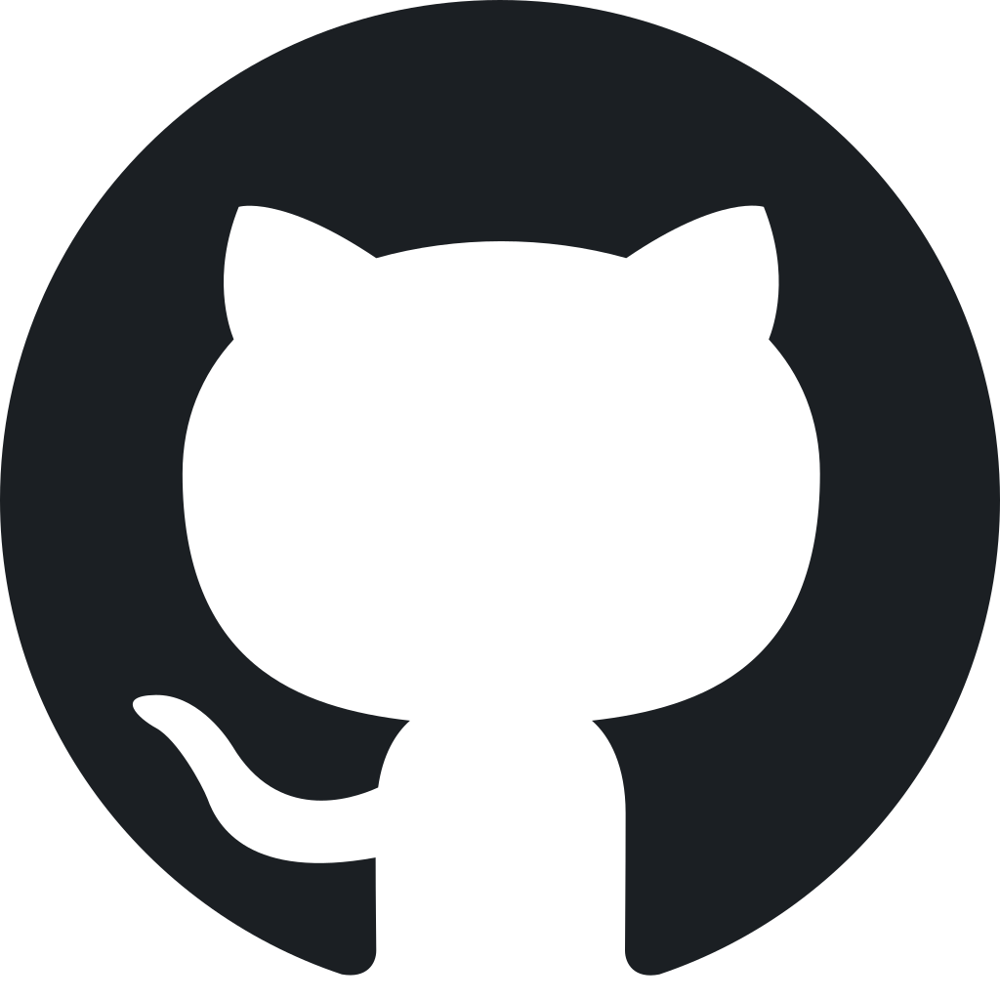
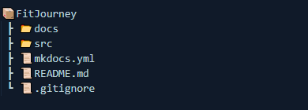
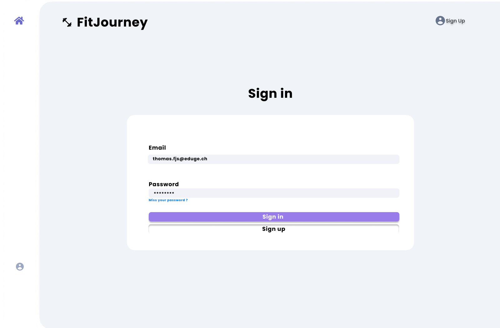
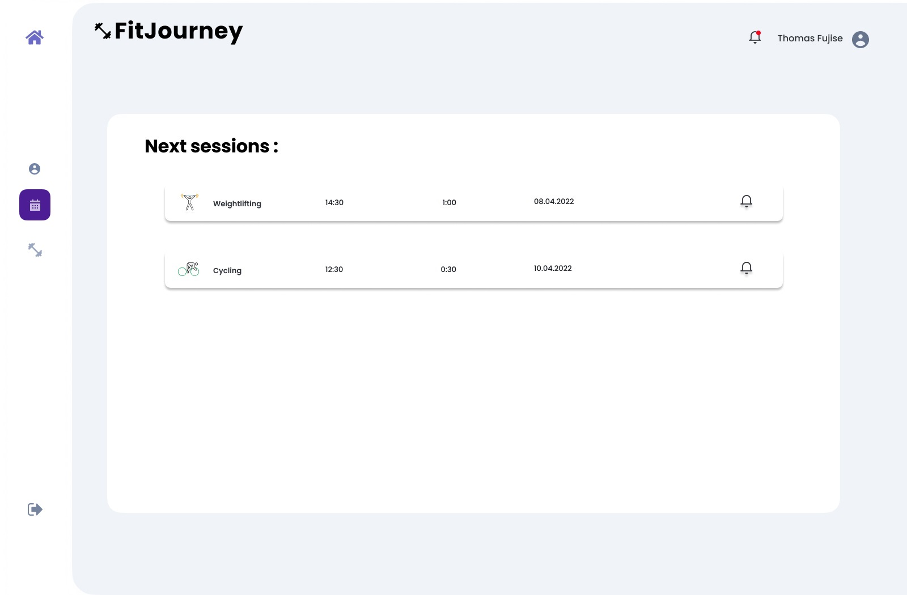
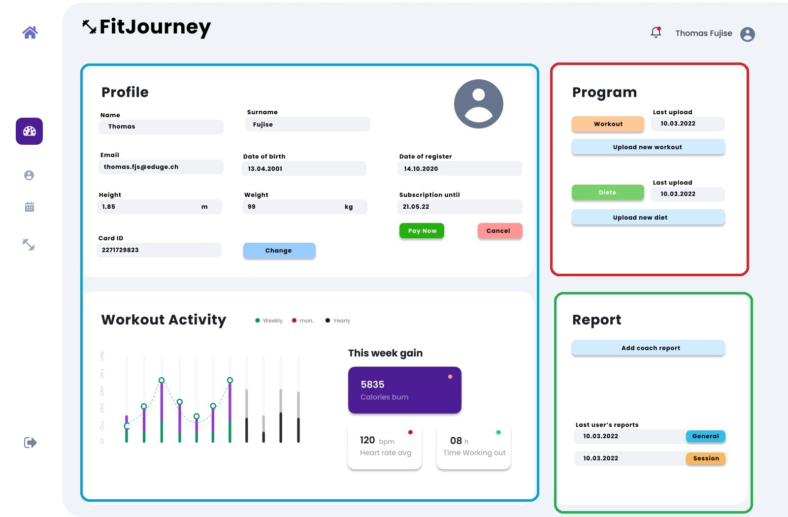
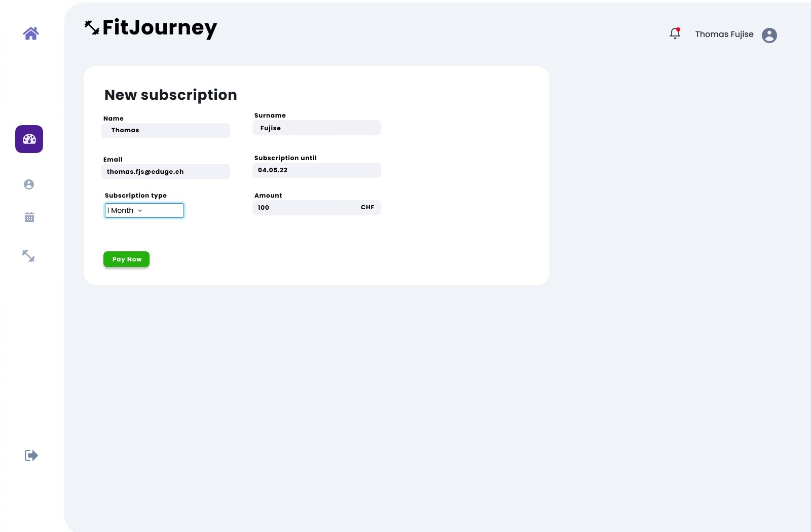

# Documentation technique 

## Résumé 
FitJourney est une application permettant, d'une part, à un coach sportif de gérer le suivi de tous ses clients avec des données d'entrainements récupérées à l'aide de montres connectés Polar. D'autre part, elle permet aux clients d'accéder à leurs programmes d'entrainements et de nutrition. L'application permet également aux clients de visionner le détail de chacune de leurs séances.

FitJourney est une application WEB réalisée avec le framework Flask du langage Python, elle repose principalement sur l'API Polar Accesslink qui permet l'utilisation des données des montres connectées

Ce document reprend toutes les étapes du projet qui a été réalisé dans le cadre du travail de diplôme de la formation Technicien ES en informatique de Thomas Fujise.

## Abstract
FitJourney is an application that allows personal trainers to follow up all his clients training data that is retrieved using Polar connected watches. It also allows clients to access their training and diet plan. The application allows clients to look at the details of each of their workouts.

FitJourney is a WEB application made with Flask Python framework. It relies mainly on the Polar Accesslink API which allows the use of data from connected watches.

This document contains all the steps of the project, which was carried out within the diploma project of the IT Technician formation of Thomas Fujise

## Introduction
Il existe très peu d'outil qui permet à un coach sportif de gérer sa salle de sport avec le suivi de tous ses clients. 

## Analyse de l'existant

## Cahier des charges

## Analyse fonctionnelle

## Analyse Organique

### Mise en place

### Environnement

#### GitHub
{width=200 align="right"}

Pour pouvoir garder un suivi constant de mon projet, j'ai choisis d'utiliser GitHub comme outil de contrôle de version.

Voici comment est structuré le github :

* Le dossier docs/ contient les fichiers de documentation et de journal de bord
* Le dossier src/ contient tout le code source de l'application
 
#### Trello
{width=200 align="right"}

Trello est un outil de gestion de projet en ligne, inspiré par la méthode Kanban. Il repose sur une organisation des projets en planches listant des cartes, chacune représentant des tâches. 

Afin de créer une roadmap pour mon projet, j'ai utilisé Trello pour lister les différentes étapes de mon projet. J'ai ensuite pu définir les échéances pour chaque tâches/étapes avec mon planning prévisionnel.

J'ai créé 5 colonnes :

* Backlog (Liste de toutes les tâches)
* To-Do (Les tâches qui ont été validées et qui sont à faire)
* Doing (Les tâches en cours)
* Testing (Les tâches en cours de test)
* Done (Les tâches terminées)

#### Python Flask
Flask est un micro-framework python qui permet la création d'applications web évolutives. Flask dépend de la boite à outils WSGI de [Werkzeug](https://werkzeug.palletsprojects.com/en/2.0.x/) et du moteur de templates [Jinja](https://jinja.palletsprojects.com/en/3.0.x/).

##### Micro framework
Un micro framework est un framework qui tente de fournir uniquement les composants absoluments nécessaires à un développeur pour la création d'une application. Par exemple dans le cas d'une application Web, un micro framework peut être spécifiquement conçu pour la construction d'API pour un autre service/application.

Le terme *micro* dans le micro framework signifie que Flask vise à garder le code de base simple mais extensible. Flask ne prendra pas beaucoup de décisions, par exemple quelle base de données utiliser. Les décisions qu'il prend, telles que le moteur de templates à utiliser, sont faciles à modifier. Tout le reste est libre, de sorte que Flask puisse répondre à tous nos besoins et à tous ce que vous ne voulez pas en même temps.

En définissant uniquement le moteur de templates et un système de routes, Flask laisse le choix de personnaliser (en ajoutant des packages) pour la gestion des formulaires par exemple.

### Maquettage
Pour préparer les interfaces, j'ai réalisé des maquettes avec l'outil Figma. Les maquettes m'ont permis de mettre à plat les éléments nécessaires pour les interfaces et ont évité de perdre trop de temps lors de la création des interfaces.

L'application FitJourney propose 3 niveaux d'accès :

* Visiteur
* Client
* Coach

#### En tant que visiteur 
Lorsqu'on arrive sur l'application sans être authentifié, seuls 3 pages sont accessibles. 
##### Page d'accueil

La page d'accueil est très basique et propose les boutons permettant de s'enregistrer ou de se connecter.
##### Page de connexion 

La page de connexion permet aux utilisateurs de se connecter. Un lien est disponible si le mot de passe a été oublié.

##### Page d'enregistrement

La page d'enregistrement permet aux utilisateurs de s'enregistrer, une option est disponible pour permettre la création d'un nouveau compte coach. 

#### En tant que client 
Si on se connecte à l'application en tant que client, 4 pages supplémentaires sont disponibles.

##### Page profile

La page profil permet au client de modifier ses informations personnelles. Il a également accès à des statistiques sur les données des entrainements qu'il a effectué cette semaine.

##### Page liste de nos entrainements

Cette page affiche la liste de toutes les entrainements effectués par le client. 

##### Page détails entrainement

Cette page affiche les détails d'un entrainement avec les données récupéré avec la smartwatch.

##### Page prochaine session

Cette page affiche les prochaines sessions d'entrainements avec un coach du client 

#### En tant que coach
Si on se connecte à l'application en tant que coach, on a alors accès à 5 pages supplémentaire.

##### Page profile client

La page profile client permet au coach de visionner le profil de ses clients. Des options supplémentaires sont disponibles :

* Changement de la carte de membre
* Renouvellement/Annulation de l'abonnement
* Importation des programmes

##### Page tableau de bord

La page tableau de bord permet au coach de voir la liste des clients qu'ils dont il effectue le suivi. Il voit également la prochaine session avec un client.

##### Page Calendrier

La page calendrier permet au coach d'avoir accès à un calendrier pour visionner les rendez-vous déjà enregistrer et en ajouter de nouveau.

##### Page Ajout de client 

La page ajout de client permet au coach d'effectuer la prise en charge d'un client. Le coach peut séléctionner un compte déjà existant (si le client en a déjà créé un) ou créer un nouveau compte client.

##### Page Paiement

La page paiement permet de valider le paiement d'un client (Aucune transaction n'est effectué par l'application)